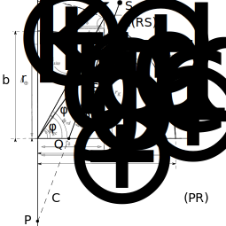

人工衛星の軌道やGNSSログなど、XYZの形で表された座標データを、緯度・経度・高度の形に変換する方法について考えてみよう。
一見すると簡単な幾何学の問題に思えるが、地球を「球」ではなく「回転楕円体」として扱おうとすると、途端に話はややこしくなる。
ECEF（Earth Centered Earth Fixed）座標から測地（geodetic）座標への変換は、実は解析的に解くのが難しく、古くから多くの研究者が効率的な解法を競ってきたトピックだ。
今回は、測地座標への変換の基礎と、PROJの実装にも採用されているBowringの手法、そしてVermeilleによる解析的なアプローチについて紹介していきたい。

## ECEF座標と測地（geodetic）座標の関係

まず地球表面上の点$\boldsymbol{r}_\mathrm{site}$を式で表すことを考えよう。
地球はおおよそ回転楕円体Spheroid（楕円体Ellipsoidのうち1軸に関しては軸対称なもの）で、地軸回りで対称、南北方向に少し押しつぶしたような形をしているので、以下のように表すことができる。
ここで$\varphi_\mathrm{rd}$はreduced latitudeと呼ばれるもので、geocentric latitude $\varphi_\mathrm{gc}$ではないことに注意しよう。

$$
\begin{gather}
\boldsymbol{r}_\mathrm{site} = \left[ \begin{array}{c}
R_\oplus \cos\varphi_\mathrm{rd} \cos\lambda \\
R_\oplus \cos\varphi_\mathrm{rd} \sin\lambda \\
b_\oplus \sin\varphi_\mathrm{rd} \end{array} \right]
\end{gather}
$$


_Figure 1: Spheroidal Earth Geometry and Geodetic Coordinate Parameters._

一方で、geocentric latitude $\varphi_\mathrm{gc}$を使って表すこともできるはずで、$r_\mathrm{site}$は何かしらの緯度の関数になる。

$$
\begin{gather}
\boldsymbol{r}_\mathrm{site} = \left[ \begin{array}{c}
r_\mathrm{site} \cos\varphi_\mathrm{gc} \cos\lambda \\
r_\mathrm{site} \cos\varphi_\mathrm{gc} \sin\lambda \\
r_\mathrm{site} \sin\varphi_\mathrm{gc} \end{array} \right]
\end{gather}
$$

これらの式を見比べると、$\varphi_\mathrm{rd}$と$\varphi_\mathrm{gc}$の間に以下の関係が得られる。

$$
\begin{gather}
\tan \varphi_\mathrm{gc} = \frac{b_\oplus}{R_\oplus} \tan \varphi_\mathrm{rd}
\end{gather}
$$

次に、$\varphi_\mathrm{rd}$と$\varphi_\mathrm{gd}$の関係を導く。
$\boldsymbol{r}_\mathrm{site}$での接面の方向は、$\varphi_\mathrm{rd}$と$\lambda$について微分してやると分かる。

$$
\begin{align}
\frac{d}{d\varphi_\mathrm{rd}} \boldsymbol{r}_\mathrm{site} &= \left[ \begin{array}{c}
-R_\oplus \sin\varphi_\mathrm{rd} \cos\lambda \\
-R_\oplus \sin\varphi_\mathrm{rd} \sin\lambda \\
b_\oplus \cos\varphi_\mathrm{rd} \end{array} \right], \\
\frac{d}{d\lambda} \boldsymbol{r}_\mathrm{site} &=
\left[ \begin{array}{c}
-R_\oplus\cos\varphi_\mathrm{rd} \sin\lambda \\
+R_\oplus\cos\varphi_\mathrm{rd} \cos\lambda \\
0
\end{array} \right]. \\
\end{align}
$$

で、これをよく見ると、$\bm{r}_\mathrm{site}$での法線方向が分かる。

$$
\begin{gather}
\boldsymbol{n} = \left[ \begin{array}{c}
b_\oplus \cos\varphi_\mathrm{rd} \cos\lambda \\
b_\oplus \cos\varphi_\mathrm{rd} \sin\lambda \\
R_\oplus \sin\varphi_\mathrm{rd}
\end{array} \right]
\end{gather}
$$

法線方向が分かると、reduced latitude $\varphi_\mathrm{rd}$とgeodetic latitude $\varphi_\mathrm{gd}$の関係を求めることができる。

$$
\begin{gather}
\tan \varphi_\mathrm{gd} = \frac{R_\oplus}{b_\oplus} \tan \varphi_\mathrm{rd}
\end{gather}
$$

式(3)および式(7)より、geocentric latitude $\varphi_\mathrm{gc}$はgeodetic latitude $\varphi_\mathrm{gd}$を用いて次のようにあらわされる。

$$
\begin{gather}
\tan \varphi_\mathrm{gc} = \frac{b_\oplus^2}{R_\oplus^2} \tan \varphi_\mathrm{gd}
\end{gather}
$$

これで、地表面でgeocentricなパラメタからgeodeticなパラメタへ変換することができた。
ただ今知りたいのは、軌道上の点$(x,y,z)$からgeodeticなパラメタを求めることで、これにはもうひと手間いる。
目標は$(x,y,z)$をgeodeticなパラメタのみで表して、逆に解くことである。
そのためにradius of curvature in the prime vertical $C_\oplus$を$\varphi_\mathrm{gd}$を用いて表す。

$$
\begin{align}
\left[ \begin{array}{c} x \\ y \\ z \end{array} \right] =
\left[ \begin{array}{c}
    (C_\oplus + h_\mathrm{ellp}) \cos\varphi_\mathrm{gd} \cos\lambda \\
    (C_\oplus + h_\mathrm{ellp}) \cos\varphi_\mathrm{gd} \sin\lambda \\
    (S_\oplus + h_\mathrm{ellp}) \sin\varphi_\mathrm{gd}
\end{array} \right]
\end{align}
$$

$$
\begin{align}
r_\delta
&= r_\mathrm{site} \cos \varphi_\mathrm{gc}
= R_\oplus \cos \varphi_\mathrm{rd}
= C_\oplus \cos \varphi_\mathrm{gd} \\
r_\mathrm{k}
&= r_\mathrm{site} \sin \varphi_\mathrm{gc}
% = R_\oplus \frac{b_\oplus}{R_\oplus}\sin \varphi_\mathrm{rd}
= R_\oplus \sqrt{1-e_\oplus^2}\sin \varphi_\mathrm{rd}
= S_\oplus \sin \varphi_\mathrm{gd}
\end{align}
$$

上式で、$\cos \varphi_\mathrm{rd}$が未知となっているが、
以下の関係式から、$\cos \varphi_\mathrm{rd}$は$\varphi_\mathrm{gd}$を用いて表すことができる。

$$
\begin{align}
&\tan^2\varphi_\mathrm{gd} = \frac{R_\oplus^2}{b_\oplus^2} \left(\frac{1}{\cos^2\varphi_\mathrm{rd}} - 1 \right) \\
&\frac{1}{\cos^2\varphi_\mathrm{rd}} = \frac{b_\oplus^2}{R_\oplus^2} \tan^2\varphi_\mathrm{gd} + 1 \\
&\cos\varphi_\mathrm{rd} = \frac{1}{\sqrt{\frac{b_\oplus^2}{R_\oplus^2} \tan^2\varphi_\mathrm{gd} + 1}}, \quad \mathrm{where} \quad -\frac{\pi}{2} \le \varphi_\mathrm{rd} \le \frac{\pi}{2}
\end{align}
$$

最終的に、$C_\oplus$は次のように表される。

$$
\begin{align}
C_\oplus &= \frac{R_\oplus}{\cos\varphi_\mathrm{gd}} \frac{1}{\sqrt{\frac{b_\oplus^2}{R_\oplus^2} \tan^2\varphi_\mathrm{gd} + 1}}
= \frac{R_\oplus}{\sqrt{\frac{b_\oplus^2}{R_\oplus^2} \sin^2\varphi_\mathrm{gd} + \cos^2\varphi_\mathrm{gd}}} \notag \\
&= \frac{R_\oplus}{\sqrt{(1-e_\oplus^2) \sin^2\varphi_\mathrm{gd} + \cos^2\varphi_\mathrm{gd}}}
= \frac{R_\oplus}{\sqrt{1 - e_\oplus^2 \sin^2\varphi_\mathrm{gd}}}
\end{align}
$$

$S_\oplus$も同様に整理できて、以下のように表される。

$$
\begin{equation}
S_\oplus = \frac{R_\oplus(1-e_\oplus^2)}{\sqrt{1 - e_\oplus^2 \sin^2 \varphi_{\mathrm{gd}}}}
\end{equation}
$$

## 数値計算による変換

ここで具体的な変換方法について考えてみよう。
基準となる楕円体としてWGS84を用いることとし、これは長半径（semi-major axis）$R_\oplus$および扁平率（flattening）$f_\oplus$で表される。

$$
\begin{gather}
R_\oplus = 6378.137~\mathrm{km}, \quad
f_\oplus = \frac{1}{298.257223563}
\end{gather}
$$

その他のパラメタは次のように計算できる。

$$
\begin{align}
e_\oplus &= \sqrt{2f_\oplus - f_\oplus^2} = 0.0818191908426215, \\
b_\oplus &= R_\oplus \sqrt{1-e_\oplus^2} = R_\oplus(1-f_\oplus) = 6356.75231424518~\mathrm{km}. \\
\end{align}
$$

経度に関しては、特に問題なく次のように計算できる。

$$
\begin{gather}
\lambda = \arctan2 (y,x)
\end{gather}
$$

緯度と高度に関してはexplicitに解けなさそうなので、数値的に求めることを考えてみる。
まず、仮に$\varphi_\mathrm{gd}$が分かっていた場合には、$h_\mathrm{ellp}$は簡単に決定できる。

$$
\begin{align}
h_\mathrm{ellp} &= \frac{\sqrt{x^2+y^2}}{\cos\varphi_\mathrm{gd}} - C_\oplus
= \frac{\sqrt{x^2+y^2}}{\cos\varphi_\mathrm{gd}} - \frac{R_\oplus}{\sqrt{1 - e_\oplus^2 \sin^2\varphi_\mathrm{gd}}} \\
h_\mathrm{ellp} &= \frac{z}{\sin\varphi_\mathrm{gd}} - S_\oplus
= \frac{z}{\sin\varphi_\mathrm{gd}} - \frac{R_\oplus(1-e_\oplus^2)}{\sqrt{1 - e_\oplus^2 \sin^2 \varphi_{\mathrm{gd}}}}
\end{align}
$$

これらが等しくなるように、以下の関係を満たす$\varphi_\mathrm{gd}$を数値的に求めればよい。

$$
\begin{gather}
z - \sqrt{x^2+y^2} \tan \varphi_\mathrm{gd} + \frac{e_\oplus^2 R_\oplus \sin\varphi_\mathrm{gd}}{\sqrt{1 - e_\oplus^2 \sin^2 \varphi_{\mathrm{gd}}}} = 0
\end{gather}
$$

$$
\begin{gather}
\varphi_0 = \arctan \left( \frac{z}{\sqrt{x^2 + y^2}} \right)
\end{gather}
$$

初期値はgeocentricなパラメタを用いることとして、
例えばPythonで以下のようなスクリプトを書くと、実際にgeodetic latitudeを求めることができる。

```python
# WGS84 parameters
flattening = 1/298.257223563
semimajor = 6378.137
eccentricity = np.sqrt(2*flattening - flattening**2)

def geodetic_latitude(x, y, z):
    """ calculate the geodetic latitude

    # Args:
        x(ndarray): x coordinate in ECEF, km
        y(ndarray): y coordinate in ECEF, km
        z(ndarray): z coordinate in ECEF, km

    # Returns:
        latitude(ndarray): geodetic latitude, rad
    """
    params = (x, y, z)
    latitude = np.arctan(z/ np.sqrt(x**2 + y**2))
    return optimize.fsolve(latitude_equation, latitude, args=params)

def latitude_equation(x: np.ndarray, *args) -> np.ndarray:
    """ equation to be solved

    # Args:
        *args(tuple): (x, y, z)

    # Returns:
        latitude(ndarray): latitude
    """
    return args[2] - np.sqrt(args[0]**2 + args[1]**2) * np.tan(x) + eccentricity**2 * semimajor * np.sin(x) / np.sqrt(1 - eccentricity**2 * np.sin(x)**2)
```

これでECEF座標からgeodeticなパラメタへの変換の基本は理解できた。
ただこの方法で解を探すと、データ量が増えるにつれて膨大な計算量が必要になってしまうので、より効率的な方法が欲しくなってくる。

## Vermeilleの解析的な変換手法

先ほどは、導出した式の複雑さから、解析解を求めることは早々に諦めてしまったが、
実は４次の代数方程式に帰着させることで、Geodetic latitudeと高度を解析的に求めることが出来る。
ここではVermeilleによって提案された、解析的な変換手法について見てみよう[[2]](#reference)。

まず、次のような変数$k$を定義する。これは常に$k>0$となる。

$$
\begin{align}
&k = \frac{QS}{PR} = \frac{h_\mathrm{ellp} + C_\oplus - e_\oplus^2 C_\oplus}{C_\oplus} \\
&h_\mathrm{ellp} = (k + e_\oplus^2 - 1) C_\oplus = k C_\oplus - S_\oplus
\end{align}
$$

この$k$を用いた関係式を作るために、$C_\oplus$を$k$で表す。

$$
\begin{align}
\sin\varphi_\mathrm{gd} = \frac{z}{S_\oplus + h_\mathrm{ellp}}
= \frac{z}{k C_\oplus}
\end{align}
$$

$$
\begin{align}
C_\oplus^2 &= \frac{R_\oplus^2}{(1 - e_\oplus^2 \sin^2\varphi_\mathrm{gd})} = R_\oplus^2 + C_\oplus^2 e_\oplus^2 \sin^2\varphi_\mathrm{gd} \notag \\
&= R_\oplus^2 + \frac{e_\oplus^2 z^2}{k^2}
\end{align}
$$

これらを用いて、$x^2+y^2$を書き換えていく。

$$
\begin{align}
x^2 + y^2
&=(h_\mathrm{ellp} + C_\oplus)^2 \cos^2\varphi_\mathrm{gd}
= (k + e_\oplus)^2 C_\oplus^2 (1 - \sin^2\varphi_\mathrm{gd}) \notag \\
&=(k + e_\oplus)^2 C_\oplus^2 \left( 1 - \frac{z^2}{k^2 C_\oplus^2} \right) \notag \\
&=(k + e_\oplus)^2 \left( R_\oplus^2 + \frac{e_\oplus^2 z^2}{k^2} - \frac{z^2}{k^2}\right)
\end{align}
$$

$$
\begin{align}
\frac{x^2+y^2}{(k+e_\oplus^2)^2} + \frac{(1 - e_\oplus^2) z^2}{k^2} = R_\oplus^2
\end{align}
$$

ここで、$p, q$を以下のようにおく。

$$
\begin{align}
p = \frac{x^2 + y^2}{R_\oplus^2}, \quad q = \frac{1-e_\oplus^2}{R_\oplus^2} z^2
\end{align}
$$

これらを用いて、$k$について4次の代数方程式を作る。
4次の代数方程式は一般に解くことが可能で、Ferrariの解法をはじめ様々な手法がある。
ただ、Vermeilleはそれらの手法をそのまま用いるのではなく、ところどころに式変形のアイデアを取り入れて、因数分解していっている。

$$
\begin{align}
k^4 + 2e_\oplus^2 k^3 - (p+q-e_\oplus^4) k^2 - 2e_\oplus^2 q k - e_\oplus^4 q = 0
\end{align}
$$

ここで謎のパラメタ$u$を導入する。$u$が任意の値の場合について、次の式が成り立つ。

$$
\begin{align}
(k^2 + e_\oplus^2 k - u)^2 - \left[ (p+q-2u) k^2 + 2e_\oplus^2(q-u)k + u^2 + e_\oplus^4 q \right] = 0
\end{align}
$$

カギ括弧の中身は$k$の2次方程式になっているが、
これについて判別式がゼロになるように要求すると、以下の関係式が得られる。
この式が満たされるときカギ括弧の中は$(\cdots)^2$の形で書けて、式全体が因数分解できることが分かる。
形は少し異なるものの、謎パラメタを導入しつつ、判別式ゼロを要求することで、因数分解できる形にする、というのはFerrariの解法と類似している。

$$
\begin{align}
e_\oplus^4 (q-u)^2 - (p+q-2u)(u^2 + e_\oplus^4 q) = 0
\end{align}
$$

$$
\begin{align}
2u^3 - (p + q - e_\oplus^4) u^2 + e_\oplus^4 pq = 0
\end{align}
$$

さらに、変数$r, s$を以下のように置く。

$$
\begin{align}
r = \frac{p+q-e_\oplus^4}{6}, \quad s = e_\oplus^4 \frac{pq}{4r^3}
\end{align}
$$

ただし、これらの変数は常に正である。

$$
\begin{align}
p + q = \frac{x^2 + y^2}{R_\oplus^2} + \frac{(1-e_\oplus^2) z^2}{R_\oplus^2}
= \frac{x^2}{R_\oplus^2} + \frac{y^2}{R_\oplus^2} + \frac{z^2}{b_\oplus^2} > 1
\end{align}
$$

これらを用いて、さらに式(35)の全体を$2r^3$で割ると以下ように$u/r$に関する3次方程式が得られる。

$$
\begin{align}
\frac{u^3}{r^3} - 3\frac{u^2}{r^2} - 2s = 0
\end{align}
$$

ここで$u/r$を式(39)のように置いて、$t$の式に書き換える。$t>0$の範囲では、$t=1$で$1+t+\frac{1}{t}$は極小値3をとり、式(40)の左辺は$-2s$になる。
$t$が動けば、$\frac{u}{r}$は増加し、$0<t<1$の範囲でひとつ、$t>1$の範囲でもひとつ解を持つはずだ。
（ちなみに、相反方程式と呼ばれる形の代数方程式は、$x+\frac{1}{x}=t$という変形をすることで、うまく因数分解できる。ちょっと形は違うがその辺からインスピレーションを受けているのかもしれない。）

$$
\begin{align}
\frac{u}{r} = 1 + t + \frac{1}{t}
\end{align}
$$

$$
\begin{gather}
t^6 - 2(1+s)t^3 + 1 = 0
\end{gather}
$$

実際、$0<t<1$と$t>1$の範囲に以下のような解を見つけることができる。

$$
\begin{align}
t^3 &= 1 + s \pm \sqrt{s(2+s)} \\
t &= \sqrt[3]{1 + s \pm \sqrt{s(2+s)}}
\end{align}
$$

で、いずれの$t$の解が得られても$\frac{u}{r}$の値は同じなので、どっちか好きな方を選べばよい。とりあえず、ここではプラスの方を選ぶことにしよう。
これで、式(33)のカギ括弧内を2乗の形で表せるような$u$を求めることができた。

$$
\begin{align}
(k^2 + e_\oplus^2 k - u)^2 - \left( e_\oplus^2 \frac{q-u}{v}k + v \right)^2 = 0, \quad
\mathrm{where}\quad v = \sqrt{u^2 + e_\oplus^4 q}
\end{align}
$$

$$
\begin{align}
\left( k^2 + \frac{v-u+q}{v}e_\oplus^2k + v - u\right)\left( k^2 + \frac{v-u+q}{v}e_\oplus^2k - v - u\right) = 0
\end{align}
$$

式(44)のひとつ目の括弧内は、$v-u, v, q$がいずれも正なので、$k>0$に解は持たない。
なので、興味があるのはふたつ目の括弧内の方である。$u+v$が正なので、$k>0$の解はひとつだけで、これは以下のように書ける。

$$
\begin{gather}
k = \sqrt{u+v+w^2} - w, \quad \mathrm{where} \quad w = e_\oplus^2\frac{u+v-q}{2v}
\end{gather}
$$

これで$k$が一意に求まったので、geodetic latitude $\varphi_\mathrm{gd}$も高度$h_\mathrm{ellp}$も求めることができる。

$$
\begin{equation}
D = \frac{k\sqrt{x^2+y^2}}{k+e_\oplus^2}, \quad
C_\oplus = \frac{\sqrt{D^2+z^2}}{k}
\end{equation}
$$

$$
\begin{equation}
h_\mathrm{ellp} = \frac{k+e_\oplus^2-1}{k} \sqrt{D^2 + z^2}, \quad
\varphi_\mathrm{gd} = 2 \arctan \frac{z}{D+\sqrt{D^2+z^2}}
\end{equation}
$$

元論文[[2]](#reference)には変換に最低限必要な式がリストアップされているので、
それらをもとに簡単なスクリプトを書くと、ECEF座標からgeodeticなパラメタへの変換を実行できる。

```python
# WGS84 parameters
flattening = 1/298.257223563
semimajor = 6378.137
eccentricity = np.sqrt(2*flattening - flattening**2)

def geodetic_vermeille(x, y, z):
    """ calculate the geodetic latitude and altitude based on
    H. Vermeille, "Direct transformation from geocentric to geodetic coordinates", 2002, Journal of Geodesy, 76:451-454

    # Args:
        x(ndarray): x coordinate in ECEF, km
        y(ndarray): y coordinate in ECEF, km
        z(ndarray): z coordinate in ECEF, km

    # Returns:
        lat(ndarray): geodetic latitude, rad
        lon(ndarray): geodetic longitude, rad
        h(ndarray): geodetic altitude, km
    """
    p = (x**2 + y**2)/semimajor**2
    q = (1 - eccentricity**2) * z**2 / semimajor**2
    r = (p + q - eccentricity**4)/6
    s = eccentricity**4 * p * q / (4 * r**3)
    t = (1 + s + np.sqrt(s * (2 + s)))**(1/3)
    u = r * (1 + t + 1/t)
    v = np.sqrt(u**2 + eccentricity**4 * q)
    w = eccentricity**2 * (u + v - q)/(2 * v)
    k = np.sqrt(u + v + w**2) - w
    D = k * np.sqrt(x**2 + y**2)/(k + eccentricity**2)
    lat = 2 * np.arctan(z/(D+np.sqrt(D**2 + z**2)))
    lon = np.arctan2(y, x)
    h = (k + eccentricity**2 - 1)/k * np.sqrt(D**2 + z**2)
    return lat, lon, h
```

## Bowringの反復的な変換手法

解析解は理論的には美しいものの、コンピュータ上で計算する以上、結局のところ浮動小数点誤差の影響は避けられない。
数値解であったとしても、十分な精度でかつより少ない計算量で解けるならば、実用上はそちらの方が望ましい場合も多い。
実際、PROJ v9.7.0ではBowringによる手法が採用されている[[3]](#reference)。

再度、(23)を出発点に式変形を行ってみよう。

$$
\begin{equation}
\sqrt{x^2 + y^2} \tan \varphi_\mathrm{gd} = z + e_\oplus^2 C_\oplus \sin \varphi_\mathrm{gd}
\end{equation}
$$

(8)および(11)を用いて、$\varphi_\mathrm{gd}$を$\varphi_\mathrm{rd}$に書き換えると、次のように表される。
ただし、$1 - e_\oplus^2 = \frac{b_\oplus^2}{R_\oplus^2}$である。

$$
\begin{equation}
\sqrt{x^2 + y^2} \frac{R_\oplus}{b_\oplus} \tan \varphi_\mathrm{rd} = z + e_\oplus^2 C_\oplus \frac{R_\oplus}{S_\oplus} \sqrt{1 - e_\oplus^2} \sin \varphi_\mathrm{rd}
\end{equation}
$$

$$
\begin{align}
\tan \varphi_\mathrm{rd} &= \frac{z b_\oplus}{R_\oplus\sqrt{x^2 + y^2}} + \frac{e_\oplus^2}{1 - e_\oplus^2} \frac{1}{\sqrt{x^2 + y^2}} \frac{b_\oplus^2}{R_\oplus} \sin \varphi_\mathrm{rd} \notag \\
&= (1 - e_\oplus^2) \frac{z R_\oplus}{b_\oplus\sqrt{x^2 + y^2}} + \frac{e_\oplus^2 R_\oplus}{\sqrt{x^2 + y^2}} \sin \varphi_\mathrm{rd}
\end{align}
$$

ここで、$\tan\theta = \frac{z R_\oplus}{b_\oplus \sqrt{x^2 + y^2}}$とおくと、以下の関係式が得られる。

$$
\begin{equation}
\tan \varphi_\mathrm{rd} - (1 - e_\oplus^2) \tan\theta - \frac{e_\oplus^2 R_\oplus}{\sqrt{x^2 + y^2}} \sin \varphi_\mathrm{rd} = 0
\end{equation}
$$

この式を満たすような$\tan \varphi_\mathrm{rd}$を数値的に求めればよいのだが、
Bowringの方法によると、初期値を$\tan\theta$として、1ステップNewton-Raphson法で解を更新するだけで（地球のflatteningを前提として）高精度な解が得られる。
解の更新式、および関数$f(t)$とその導関数$f'(t)$は以下のように表される。

$$
\begin{equation}
t_{n+1} = t_n - \Delta t, \quad f(t_n) = f'(t_n) \Delta t
\end{equation}
$$

$$
\begin{equation}
f(t) = t - (1 - e_\oplus^2) \tan\theta - \frac{e_\oplus^2 R_\oplus}{\sqrt{x^2 + y^2}} \frac{t}{\sqrt{1 + t^2}}
\end{equation}
$$

$$
\begin{align}
f'(t) &= 1 - \frac{e_\oplus^2 R_\oplus}{\sqrt{x^2 + y^2}} \left( (1 + t^2)^{-\frac{1}{2}} - t^2 (1 + t^2)^{-\frac{3}{2}} \right) \notag \\
&=1 - \frac{e_\oplus^2 R_\oplus}{\sqrt{x^2 + y^2}} \frac{1}{(1 + t^2)^{\frac{3}{2}}}
\end{align}
$$

これより具体的な推定式は次のように表される。

$$
\begin{align}
\tan \varphi_\mathrm{rd} &\approx \tan\theta - \frac{f(\tan\theta)}{f'(\tan\theta)} \notag \\
&= \tan\theta - \frac{e_\oplus^2 \tan\theta - \frac{e_\oplus^2 R_\oplus}{\sqrt{x^2 + y^2}} \sin\theta}{1 - \frac{e_\oplus^2 R_\oplus}{\sqrt{x^2 + y^2}} \cos^3\theta} \notag \\
&= \tan\theta - \frac{e_\oplus^2 \tan\theta \sqrt{x^2 + y^2} - e_\oplus^2 R_\oplus \sin\theta}{\sqrt{x^2 + y^2} - e_\oplus^2 R_\oplus \cos^3\theta} \notag \\
&= \frac{(1 - e_\oplus^2) \tan\theta \sqrt{x^2 + y^2} - e_\oplus^2 R_\oplus \cos^2\theta\sin\theta + e_\oplus^2 R_\oplus \sin\theta}{\sqrt{x^2 + y^2} - e_\oplus^2 R_\oplus \cos^3\theta} \notag \\
&= \frac{\frac{b_\oplus}{R_\oplus}z + e_\oplus^2 R_\oplus \sin^3\theta}{\sqrt{x^2 + y^2} - e_\oplus^2 R_\oplus \cos^3\theta}
\end{align}
$$

求めたreduced latitude $\varphi_\mathrm{rd}$を用いて、最終的なgeodetic latitude $\varphi_\mathrm{gd}$は次のように求められる。

$$
\begin{gather}
\varphi_\mathrm{gd} = \arctan \left(\frac{R_\oplus}{b_\oplus} \tan \varphi_\mathrm{rd}\right)
\end{gather}
$$

## Reference

1. David A. Vallado, Fundamentals of Astrodynamics and Applications Fourth Edition, 2013, Microsoft Press
2. H. Vermeille, “Direct transformation from geocentric to geodetic coordinates”, 2002, Journal of Geodesy, 76:451-454, doi: [10.1007/s00190-002-0273-6](https://doi.org/10.1007/s00190-002-0273-6).
3. Bowring, B. R. (1976). TRANSFORMATION FROM SPATIAL TO GEOGRAPHICAL COORDINATES. Survey Review, 23(181), 323–327. doi: [10.1179/sre.1976.23.181.323](https://doi.org/10.1179/sre.1976.23.181.323)
