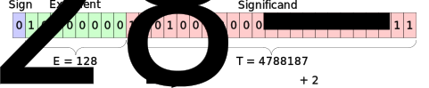

## 浮動小数点の仕組み

浮動小数点数の誤差について議論する前に、まず浮動小数点の仕組みについて確認しておこう。
まず、浮動小数点数には大きく２つのタイプがあり、バイナリ浮動小数点とデシマル浮動小数点がある。
この記事では、コンピュータ上で実数を表現する際に一般的に使用されるバイナリ浮動小数点に焦点を当てて議論を進める。

浮動小数点数の基本的なコンセプトは次のように説明できる。

- Sign bit（１ビットデータ）はその値の正負を表す。
- Exponent bitsは$2^e$の形で2のべき乗を表す。
- Significand bitsは$2^e$と$2^{e+1}$の間の範囲を等間隔に分割し、その間の実数を表現する。

このアイデアをもう少しきちんと表すと(1)のように表現できる。
例として、PIの32ビット浮動小数点数での表現をFigure 1に示す。

$$
\begin{equation}
v = (-1)^S \times 2^{E-bias} \times (1 + 2^{1-p} \times T)
\end{equation}
$$

_Figure 1: Structure of IEEE 754 floating-point format, PI in 32-bit floating point number as an example._

浮動小数点数には16ビット、32ビット、64ビット、128ビットなどの一般的なフォーマットがあり、それぞれのパラメータは次の表で示される。

| Parameter              | binary16  | binary32  | binary64  | binary128  |
| ---------------------- | --------- | --------- | --------- | ---------- |
| bias                   | 15        | 127       | 1023      | 16383      |
| sign bit, $S$          | 1         | 1         | 1         | 1          |
| exponent bits, $w$     | 5         | 8         | 11        | 15         |
| significand bits, $t$  | 10        | 23        | 52        | 112        |
| precision in bits, $p$ | 11        | 24        | 53        | 113        |
| unit roundoff, $u$     | $2^{-11}$ | $2^{-24}$ | $2^{-53}$ | $2^{-113}$ |

## 丸め誤差

ある実数をコンピュータ上で扱うには、その数値を浮動小数点数に変換する必要がある。
IEEE 754-2019 [[1]](#reference)では、変換手法として以下５種類の丸め方が定義されている。
バイナリ浮動小数点数では、デフォルトの丸め方法はroundTiesToEvenである。

| Rounding Attribute  | Rounding to ...                                                                                                                 |
| ------------------- | ------------------------------------------------------------------------------------------------------------------------------- |
| roundTiesToEven     | 与えられた数に最も近い浮動小数点数。ただし、２つの浮動小数点数が同じ距離にある場合は、最下位ビット（LSB）がゼロの浮動小数点数。 |
| roundTiesToAway     | 与えられた数に最も近い浮動小数点数。ただし、２つの浮動小数点数が同じ距離にある場合は、絶対値が大きいほうの浮動小数点数。        |
| roundTowardPositive | 与えられた数以上の最も近い浮動小数点数。                                                                                        |
| roundTowardNegative | 与えられた数以下の最も近い浮動小数点数。                                                                                        |
| roundTowardZero     | 絶対値が、与えられた数以下のもので、最も近い浮動小数点数。                                                                      |

## 浮動小数点数に変換する際の丸め誤差

ある実数$x \in \mathbb{R}$を浮動小数点数で表現する場合、誤差の大きさは$|x|$に依存して変化する。
ただ、誤差の比率$\delta$は一般的に(2)のように表現できる。このことを確認してみよう。

$$
\begin{equation}
fl(x) = x(1 + \delta), \quad |\delta| < u
\end{equation}
$$

まず誤差の絶対値は、significant bitの１ビット分よりは小さい。

$$
\begin{equation}
|fl(x) - x| < 2^{E-bias} \times \frac{1}{2^t}
\end{equation}
$$

さらに、$x$が最も近い浮動小数点数に丸められると仮定すると、誤差の大きさはもう半分にまでつめられる。

$$
\begin{equation}
|fl(x) - x| \le 2^{E-bias} \times u
\end{equation}
$$

このことから、誤差の比は次のように評価できる。

$$
\begin{equation}
\left| \frac{fl(x) - x}{x} \right| < \frac{2^{E-bias} \times u}{2^{E-bias}} = u
\end{equation}
$$

ちなみに、浮動小数点数の指数部が$2^{E-bias}$である場合、元の実数の範囲は$[2^{E-bias}- \frac{2^{E-bias}}{2^{p+1}},~2^{E-bias+1}-\frac{2^{E-bias}}{2^{p}})$となる。
なので、誤差比を評価する際に$2^{E-bias}$で$x$を代表させてしまうのは、あまいようにも思える。
しかし、もし$x < 2^{E-bias}$であれば、最大誤差は$2^{E-bias} \times \frac{1}{2^{p}}$の半分以下になるので、その場合には誤差比が最大になることはない。
そのため、誤差比の評価においては$2^{E-bias}$で$x$を代表させてしまって問題ない。

## 内積計算における誤差評価

もし$x$と$y$が誤差なしの浮動小数点数である場合、単一の演算による誤差は次のように表現されることが一般的である。

$$
\begin{equation}
fl(x~\mathrm{op}~y) = (x~\mathrm{op}~y)(1 + \delta),\quad |\delta| \le u,
\quad \mathrm{op} = +,~-,~*,~/
\end{equation}
$$

ここでは、各演算の詳細には立ち入らずに、この仮定を飲み込むことにして、それをもとに内積計算(7)によって生じる誤差について議論しよう。
誤差の大きさは演算の順序に依存するので、左から右へ演算を行うことを仮定して、誤差量を評価する。

$$
\begin{equation}
s_i = x_1 y_1 + \cdots + x_i y_i
\end{equation}
$$

内積計算の項数が小さい場合から順に、具体的な誤差評価の式は次のように表現できる。

$$
\begin{equation}
\hat{s}_1 = fl(x_1 y_1) = x_1 y_1 (1 + \delta_1)
\end{equation}
$$

$$
\begin{align}
\hat{s}_2 &= fl(\hat{s}_1 + x_2 y_2) = (\hat{s}_1 + x_2 y_2 (1 + \delta_2))(1 + \delta_3) \notag \\
&= (x_1 y_1 (1 + \delta_1) + x_2 y_2 (1 + \delta_2))(1 + \delta_3) \notag \\
&= x_1 y_1 (1 + \delta_1)(1 + \delta_3) + x_2 y_2 (1 + \delta_2)(1 + \delta_3)
\end{align}
$$

$$
\begin{align}
\hat{s}_3 &= fl(\hat{s}_2 + x_3 y_3) = (\hat{s}_2 + x_3 y_3 (1 + \delta_4))(1 + \delta_5) \notag \\
&= (x_1 y_1 (1 + \delta_1)(1 + \delta_3) + x_2 y_2 (1 + \delta_2)(1 + \delta_3) + x_3 y_3 (1 + \delta_4))(1 + \delta_5) \notag \\
&= x_1 y_1 (1 + \delta_1)(1 + \delta_3)(1 + \delta_5) + x_2 y_2 (1 + \delta_2)(1 + \delta_3)(1 + \delta_5) \notag \\
&\hspace{12pt}+ x_3 y_3 (1 + \delta_4)(1 + \delta_5)
\end{align}
$$

これをn項まで拡張すると、次のように表現できる。

$$
\begin{align}
\hat{s}_n &= fl(\hat{s}_{n-1} + x_n y_n) = (\hat{s}_{n-1} + x_n y_n(1 + \delta_{2n-2}))(1 + \delta_{2n-1}) \notag \\
&= x_1y_1 (1 + \delta_1)(1 + \delta_3) \cdots (1 + \delta_{2n-1}) \notag \\
&\hspace{11pt}+ x_2y_2 (1 + \delta_2)(1 + \delta_3) \cdots (1 + \delta_{2n-1}) \notag \\
&\hspace{11pt}+ x_3y_3 (1 + \delta_4)(1 + \delta_5) \cdots (1 + \delta_{2n-1}) \notag \\
&\hspace{51pt}\vdots \notag \\
&\hspace{11pt}+ x_ny_n (1 + \delta_{2n-2})(1 + \delta_{2n-1}),
\end{align}
$$

任意の $i = 1, 2, \cdots$に対して$|\delta_i| < u$であることを利用すると、誤差の範囲をより簡単な形で抑えることができる。
[[2]](#reference)によると、複数の$(1 + \delta_i)$たちの積の範囲は次のように表される。

$$
\begin{align}
\prod_{i=1}^n (1 + \delta_i) = 1 + \theta_n, \quad \mathrm{where} \quad |\theta_n| \le \frac{nu}{1 - nu}
\end{align}
$$

このことから、内積計算の誤差は次のように評価できる。

$$
\begin{align}
|\bm{x}^T \bm{y} - fl(\bm{x}^T \bm{y})| \le \frac{nu}{1 - nu} \sum_{i=1}^n |x_i y_i|
\end{align}
$$

## ベルヌーイの不等式

実は、(12)の関係式はもう少し詰めることができる[[3]](#reference)。
ここでは、$\prod_{i=1}^n (1 + \delta_i)$の範囲が(14), (15)のように抑えることができ、結果として(12)も成り立っていることを確認する。
ただし、パラメータの範囲を$n = 2, 3, \cdots$、$0 < u \ll 1$と仮定する。

$$
\begin{align}
\prod_{i=1}^n (1 + \delta_i) \ge (1 - u)^n > 1 - nu
\end{align}
$$

$$
\begin{align}
\prod_{i=1}^n (1 + \delta_i) \le (1 + u)^n \le 1 + \frac{nu}{1 + (1-n)u}
\end{align}
$$

下から抑える式(14)は、ベルヌーイの不等式と呼ばれるもので、数学的帰納法で簡単に確認できる。
まず$k=2$のとき、次の不等式が成り立つ。

$$
\begin{align}
(1-u)^2 = 1 - 2u + u^2 > 1-2u
\end{align}
$$

次に、$(1 - u)^k \ge 1 - ku$が成り立つと仮定して、全体に$(1 - u)$を掛けると、次の不等式が得られる。
よって、(14)が数学的帰納法により成立する。

$$
\begin{align}
(1 - u)^{k+1} \ge (1 - ku)(1 - u) = 1 - (k+1)u + ku^2 > 1 - (k+1)u
\end{align}
$$

次に、上から抑える式(15)を確認する。
$(1 - \frac{u}{1+u})^n$を(14)に適用すると、次の不等式が得られる。

$$
\begin{align}
\left( 1 - \frac{u}{1+u} \right)^n > 1 - n \frac{u}{1+u}
\end{align}
$$

$$
\begin{align}
\frac{1}{(1+u)^n} > \frac{1+u-nu}{1+u}
\end{align}
$$

いま、$1 + u -nu > 0$とすると、(15)が得られる。

$$
\begin{align}
(1 + u)^n < \frac{1+u}{1+u-nu} = 1 + \frac{nu}{1 + (1-n)u}
\end{align}
$$

## Reference

1. "IEEE Standard for Floating-Point Arithmetic" in IEEE Std 754-2019 (Revision of IEEE 754-2008), pp.1-84, 22 July 2019, doi: [10.1109/IEEESTD.2019.8766229](https://doi.org/10.1109/IEEESTD.2019.8766229).
2. Nicholas J. Higham, "Accuracy and Stability of Numerical Algorithms, Second Edition", Society for industrial and applied mathematics, 2002.
3. Dragoslav S. Mitrinović, "Analytic Inequalities", Springer Berlin, Heidelberg, 1970.
