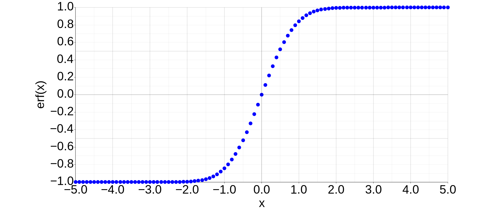

以前の記事で導出した[Hertz-Knudsen Equation](https://thermocraft.space/ja/articles/hertz-knudsen/)は、蒸発・凝縮の流量を表す式にはなっていたものの凝縮係数$\sigma_c$と蒸発係数$\sigma_e$という未知パラメタが含まれているという点が不便であった。
Schrageは蒸発・凝縮がある場合に、気相側にゼロでない平均流速がある、という仮定をMaxwell-Boltzmann分布に追加することで、Hertz-Knudsen Equationを修正した[[1]](#references)。
今回はこの修正の手順を追って、Hertz-Knudsen-Schrage Equationを導出する。

## Hertz-Knudsen Equationの修正

まずMaxwell-Boltzmann分布による速度分布で、z方向の平均流速が$\overline{v}_z$にずれている場合を想定する。
このとき、単位時間・単位面積当たりに衝突する粒子数は以下のように推定する。

$$
\begin{align}
% \label{eq:velocity_distribution}
\nu_z &= \int_{-\infty}^{\infty} \int_{-\infty}^{\infty} \int_{-\infty}^{0}
\frac{N}{V} \left( \frac{m}{2\pi k_\mathrm{B} T} \right)^{\frac{3}{2}}
\exp \left[ -\frac{m(v_x^2 + v_y^2 + (v_z - \overline{v}_z)^2)}{2k_\mathrm{B}T} \right]
|v_z|~dv_x dv_y dv_z \notag \\
&= - \frac{N}{V} \sqrt{\frac{m}{2\pi k_\mathrm{B} T}} \int_{-\infty}^{0}
\exp \left[ -\frac{m (v_z - \overline{v}_z)^2}{2k_\mathrm{B}T} \right] v_z~dv_z
\end{align}
$$

$w = v_z - \overline{v}_z$に関する積分は次のように評価できる。

$$
\begin{align}
&\int_{-\infty}^{-\overline{v}_z} (w + \overline{v}_z)
\exp \left[ -\frac{m w^2}{2k_\mathrm{B}T} \right]dw \notag \\
&= \int_{-\infty}^{-\overline{v}_z} w
\exp \left[ -\frac{m w^2}{2k_\mathrm{B}T} \right]dw + \overline{v}_z \int_{-\infty}^{-\overline{v}_z}
\exp \left[ -\frac{m w^2}{2k_\mathrm{B}T} \right]dw \notag \\
&= - \frac{k_\mathrm{B}T}{m}
\left[ \exp \left[ -\frac{m w^2}{2k_\mathrm{B}T} \right] \right]_{-\infty}^{-\overline{v}_z} + \overline{v}_z \int_{-\infty}^{0}
\exp \left[ -\frac{m w^2}{2k_\mathrm{B}T} \right]dw + \overline{v}_z \int^{-\overline{v}_z}_{0} \exp \left[ -\frac{m w^2}{2k_\mathrm{B}T} \right]dw \notag \\
&= - \frac{k_\mathrm{B}T}{m} \exp \left[- \frac{m \overline{v}_z^2}{2k_\mathrm{B}T} \right]
+ \frac{\overline{v}_z}{2} \sqrt{\frac{2\pi k_\mathrm{B}T}{m}} - \overline{v}_z \int^{\overline{v}_z}_{0} \exp \left[ -\frac{m w^2}{2k_\mathrm{B}T} \right]dw \notag \\
&= - \frac{k_\mathrm{B}T}{m} \exp \left[ -\frac{m \overline{v}_z^2}{2k_\mathrm{B}T} \right] + \frac{\overline{v}_z}{2} \sqrt{\frac{2\pi k_\mathrm{B}T}{m}}
\left[1 - \mathrm{erf} \left( \overline{v}_z \sqrt{\frac{m}{2k_\mathrm{B}T}} \right) \right]
\end{align}
$$

ただしerf(x)はerror functionと呼ばれ、(3)のように定義される。$x: -\infty \to +\infty$で$\mathrm{erf}(x): -1 \to +1$と変化する関数で、Figure 1のような形をしている。

$$
\begin{equation}
% \label{eq:erf}
\mathrm{erf}(x) = \frac{2}{\sqrt{\pi}} \int^x_0 \exp \left[ -t^2 \right] dt
\end{equation}
$$

_Figure 1: Error Function._

$t = a t'$として置換すれば、パラメタを含んだ形に書き換えることも出来る。

$$
\begin{equation}
% \label{eq:erfa}
\mathrm{erf}(x) = \frac{2 a}{\sqrt{\pi}} \int^{\frac{x}{a}}_0 \exp \left[ -(a t')^2 \right] dt'
\end{equation}
$$

これより、Liquid-Vapor Interfaceに衝突する質量流量は次のように表される。

$$
\begin{align}
&j = m \nu_z \notag \\
&= - \frac{mN}{V} \sqrt{\frac{m}{2\pi k_\mathrm{B} T}} \left\{
- \frac{k_\mathrm{B}T}{m} \exp \left[ -\frac{m \overline{v}_z^2}{2k_\mathrm{B}T} \right]
- \frac{\overline{v}_z}{2} \sqrt{\frac{2\pi k_\mathrm{B}T}{m}}
\left[1 - \mathrm{erf} \left( \overline{v}_z \sqrt{\frac{m}{2k_\mathrm{B}T}} \right) \right] \right\} \notag \\
&= \frac{N k_\mathrm{B}T}{V}
\sqrt{\frac{m}{2\pi k_\mathrm{B} T}} \exp \left[ -\frac{m \overline{v}_z^2}{2k_\mathrm{B}T} \right] - \frac{\overline{v}_z mN}{2V}
\left[1 - \mathrm{erf} \left( \overline{v}_z \sqrt{\frac{m}{2k_\mathrm{B}T}} \right) \right] \notag \\
&= P \frac{\beta}{\sqrt{\pi}} \exp \left[- \overline{v}_z^2 \beta^2 \right]
- P \overline{v}_z \beta^2 \left[1-\mathrm{erf}(\overline{v}_z \beta) \right] \notag \\
&= \frac{\beta P}{\sqrt{\pi}} \left\{ \exp \left[- \overline{v}_z^2 \beta^2 \right] - \overline{v}_z \beta \sqrt{\pi} \left[1-\mathrm{erf}(\overline{v}_z \beta) \right] \right\} \notag \\
&= \frac{\beta P}{\sqrt{\pi}} ~ \Gamma \left( \overline{v}_z \beta \right)
% = \frac{\rho}{2\sqrt{\pi} \beta} ~ \Gamma \left( \overline{v}_z \beta \right)
\end{align}
$$

ただし、$\beta$および$\Gamma$は、それぞれ以下のように置いた。
$m$は分子一個の重さで、アボガドロ数を$N_\mathrm{A}$として分子量$M = m N_\mathrm{A}$である。
また、$R$はモル気体定数で$R = k_\mathrm{B} N_\mathrm{A}$である。

$$
\begin{equation}
\beta = \sqrt{\frac{m}{2k_\mathrm{B}T}} = \sqrt{\frac{M}{2RT}}
\end{equation}
$$

$$
\begin{equation}
\Gamma \left( \overline{v}_z \beta \right) = \exp \left[ - \overline{v}_z^2 \beta^2 \right]
- \overline{v}_z \beta \sqrt{\pi} \left[ 1 - \mathrm{erf} \left( \overline{v}_z \beta \right) \right]
\end{equation}
$$

これにより、気相側からliquid-vapor interfaceに衝突する流量を$j_v$、液相側からliquid-vapor interfaceに衝突する流量を$j_l$とすると、それぞれ次のように整理できる。
液相側に関しては平均流速のオフセットはなく、[Hertz-Knudsen Equation](https://thermocraft.space/ja/articles/hertz-knudsen/)を導出したときに得られた質量流量の式をそのまま用いる。

$$
\begin{equation}
j_v = \frac{\beta P}{\sqrt{\pi}} \Gamma = \sqrt{\frac{m}{2\pi k_\mathrm{B}}} \frac{\Gamma P_v}{\sqrt{T_v}}
\end{equation}
$$

$$
\begin{equation}
j_l = \sqrt{\frac{m}{2\pi k_\mathrm{B}}} \frac{P_l}{\sqrt{T_l}}
\end{equation}
$$

気相側にのみゼロでない平均流速がある、という仮定をおく理由には以下のような点が挙げられる。

- 液相側は単位体積当たりの分子数が非常に大きいため、全体として質量移動があったとしても、気相側と比較して平均流速が十分小さいと考えられること
- 液相側は単位体積当たりの分子数が非常に大きいため、[平均自由行程](https://thermocraft.space/ja/articles/knudsen-number/)が非常に小さく、非平衡な領域を無視できると考えられること

liquid-vapor interfaceに衝突した分子の内、実際に蒸発・凝縮する割合を（いずれの方向も同じ値になると仮定して）$\alpha$とすると、全体の質量流量は$j^{LV} = \alpha (j_l - j_v)$と表される。これを整理すると、以下のようにHertz-Knudsen-Schrage Equationが得られる。

$$
\begin{equation}
% \label{eq:schrage}
j^{LV} = \alpha \sqrt{\frac{m}{2\pi k_\mathrm{B}}}\left( \frac{P_l}{\sqrt{T_l}} - \frac{\Gamma P_v}{\sqrt{T_v}} \right)
\end{equation}
$$

一方で、質量流速$j^{LV}$と平均流速$\overline{v}_z$の間には、次のような関係も同時に成り立つはずである。

$$
\begin{equation}
% \label{eq:Schrage1953_3.1-14}
j^{LV} = \rho_v \overline{v}_z
\end{equation}
$$

$\Gamma(\overline{v}_z \beta)$は、(7)のように$\overline{v}_z$に関する非線形な関数であるため、液相・気相の温度・圧力が与えられても、質量流速$j^{LV}$を陽に求めることは出来ない。

## 穏やかな蒸発・凝縮の場合

蒸発・凝縮が穏やかで平均流速が十分小さい場合、(10)をさらに変形して、熱流束と温度の関係を陽に表すことが出来る。
$\overline{v}_z \beta_v$が十分小さい場合には$\Gamma$を以下のように近似できる。

$$
\begin{equation}
% \label{eq:gamma}
\Gamma ( \overline{v}_z \beta_v ) \simeq 1 - \overline{v}_z \beta_v \sqrt{\pi}
\end{equation}
$$

この式にある$\overline{v}_z \beta_v$は、以下のように変形することが出来る。

$$
\begin{equation}
% \label{eq:Schrage1953_3.1-15}
\overline{v}_z \beta_v
= \frac{1}{2 \sqrt{\pi}} \frac{j^{LV}}{j_l} \frac{\sqrt{T_v}}{\sqrt{T_l}} \frac{P_l}{P_v}
\end{equation}
$$

(13)が成り立っていることは、以下のように確認できる。

$$
\begin{align}
&\frac{1}{2 \sqrt{\pi}} \frac{j^{LV}}{j_l} \frac{\sqrt{T_v}}{\sqrt{T_l}} \frac{P_l}{P_v}
= \frac{1}{2 \sqrt{\pi}} \frac{\rho_v \overline{v}_z}{\sqrt{\frac{m}{2\pi k_\mathrm{B}}} \frac{P_l}{\sqrt{T_l}}} \frac{\sqrt{T_v}}{\sqrt{T_l}} \frac{P_l}{P_v} \notag \\
&= \frac{1}{2 \sqrt{\pi}} \frac{\frac{m P_v}{k_\mathrm{B}T_v} \overline{v}_z}{\sqrt{\frac{m}{2\pi k_\mathrm{B}}} \frac{P_l}{\sqrt{T_l}}} \frac{\sqrt{T_v}}{\sqrt{T_l}} \frac{P_l}{P_v}
= \overline{v}_z \sqrt{\frac{m}{2 k_\mathrm{B} T_v}}
= \overline{v}_z \beta_v
\end{align}
$$

(12)、(13)を(10)に代入していくと、$j^{LV}$を次のように書き換えることが出来る。

$$
\begin{align}
j^{LV} &= \alpha \sqrt{\frac{m}{2\pi k_\mathrm{B}}}\left\{ \frac{P_l}{\sqrt{T_l}} - \frac{P_v}{\sqrt{T_v}} \left( 1 - \overline{v}_z \beta_v \sqrt{\pi} \right) \right\} \notag \\
&= \alpha \sqrt{\frac{m}{2\pi k_\mathrm{B}}}\left\{ \frac{P_l}{\sqrt{T_l}} - \frac{P_v}{\sqrt{T_v}} \left( 1 - \frac{1}{2} \frac{j^{LV}}{j_l} \frac{\sqrt{T_v}}{\sqrt{T_l}} \frac{P_l}{P_v} \right) \right\} \notag \\
&= \alpha \sqrt{\frac{m}{2\pi k_\mathrm{B}}}\left( \frac{P_l}{\sqrt{T_l}} - \frac{P_v}{\sqrt{T_v}} \right) + \alpha \sqrt{\frac{m}{2\pi k_\mathrm{B}}} \frac{P_v}{\sqrt{T_v}} \times \frac{1}{2} \frac{j^{LV}}{j_l} \frac{\sqrt{T_v}}{\sqrt{T_l}} \frac{P_l}{P_v} \notag \\
&= \alpha \sqrt{\frac{m}{2\pi k_\mathrm{B}}}\left( \frac{P_l}{\sqrt{T_l}} - \frac{P_v}{\sqrt{T_v}} \right) + \frac{\sqrt{\frac{m}{2\pi k_\mathrm{B}}} \frac{P_v}{\sqrt{T_v}}}{\sqrt{\frac{m}{2\pi k_\mathrm{B}}} \frac{P_l}{\sqrt{T_l}}} \times \frac{\alpha}{2} j^{LV} \frac{\sqrt{T_v}}{\sqrt{T_l}} \frac{P_l}{P_v} \notag \\
&= \alpha \sqrt{\frac{m}{2\pi k_\mathrm{B}}}\left( \frac{P_l}{\sqrt{T_l}} - \frac{P_v}{\sqrt{T_v}} \right) + \frac{\alpha}{2} j^{LV}
\end{align}
$$

$$
\begin{equation}
\left( 1- \frac{\alpha}{2} \right) j^{LV} = \alpha \sqrt{\frac{m}{2\pi k_\mathrm{B}}}\left( \frac{P_l}{\sqrt{T_l}} - \frac{P_v}{\sqrt{T_v}} \right)
\end{equation}
$$

最終的に以下の関係式が得られて、これもHertz-Knudsen-Schrage Equationと呼ばれる。

$$
\begin{gather}
% \label{eq:schrage2}
j^{LV} = \frac{2 \alpha}{2 - \alpha} \sqrt{\frac{m}{2\pi k_\mathrm{B}}}\left( \frac{P_l}{\sqrt{T_l}} - \frac{P_v}{\sqrt{T_v}} \right)
\end{gather}
$$

今回紹介したHertz-Knudsen-Schrage Equationは、比較的簡単に蒸発・凝縮をモデル化できるツールとして、たまに本や論文で出てくる。
実際に式(1)を見てみると、平均流速を用いてマクスウェル・ボルツマン分布を修正していることが分かる。
確かに蒸発・凝縮が進んでいる場合は、全体としてある平均流速で質量が移動しているのは間違いないのだが、その場合の分子の速度分布を(1)の形で表してよいのか、という点については、明確な物理的根拠があるわけではない。
あくまで簡易的に分子の速度分布を表現するための仮定であることに注意が必要である。

## References

1. Robert W. Schrage, "A theoretical study of interphase mass transfer", Columbia University Press, 1953, doi: [10.7312/schr90162](https://doi.org/10.7312/schr90162)
