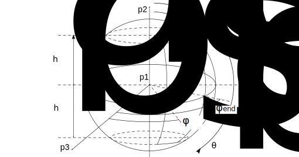

輻射による熱のやり取りを評価する場合，レイトレースすることで物体間のRadiative Coupling（または形態係数）を求めることが出来る．
このとき光線は，物体の表面上で面積に関して一様になるように発生点を指定して，そこからランベルトの余弦則に沿うように光線の方向を決めてやる必要がある．
今回は基本的な表面形状（長方形・三角形・円板・球面・円柱・円錐・放物面）について，0–1の範囲のランダム値からどうやって一様分布を発生させるかを考える．

## 長方形

一様分布を考えるとき、もっともシンプルなケースは長方形だろう。
Figure 1のような長方形上に点を一様分布させる場合は，2つのランダム値$(q_1, q_2)$を発生させて，以下のように計算すればよい．
平行四辺形の場合でも同様の方法が使える。

$$
\begin{equation}
\vec{p} = q_1 (\vec{p_2} - \vec{p_1}) + q_2 (\vec{p_3} - \vec{p_1})
\end{equation}
$$

_Figure 1: Point Distribution on a Rectangle._

## 三角形

三角形上に点を一様分布させる場合、長方形と同様にEq. (1)を用いて計算することができる。
ただし、指定した点が三角形の外にある場合を除外するために、2つのランダム値$(q_1, q_2)$の和が1以下である必要がある。
もし和が1を超えた場合は、その値を破棄し、有効な組み合わせが得られるまで新しいランダム値を生成する。

_Figure 2: Point Distribution on a Triangle._

## 円柱側面

円柱側面上に点を一様分布させる場合は，高方向・周方向それぞれ一様に値をとればよい．
高さ$h$と周方向のパラメタ$\varphi$は、ランダム値$q_1$と$q_2$を用いてそれぞれ以下のように計算できる。

$$
\begin{gather}
h = h_\mathrm{max} ~q_1
\end{gather}
$$

$$
\begin{gather}
\varphi = (\varphi_\mathrm{end} - \varphi_\mathrm{start})~ q_2 + \varphi_\mathrm{start}
\end{gather}
$$

_Figure 3: Point Distribution on a Cylindrical Surface._

## 円板

部分円板上に点を一様にばらまく場合，ある点が半径方向の位置$r$の内側に入る確率$q_1$は次のように表される．

$$
\begin{equation}
q_1 = \frac{\int_{r_\mathrm{inner}}^{r} \int_{\theta_\mathrm{start}}^{\theta_\mathrm{end}} r dr d\theta}{\int_{r_\mathrm{inner}}^{r_\mathrm{outer}} \int_{\theta_\mathrm{start}}^{\theta_\mathrm{end}} r dr d\theta}
= \frac{r^2 - r_\mathrm{inner}^2}{r_\mathrm{outer}^2 - r_\mathrm{inner}^2}
\end{equation}
$$

この式を$r$について解くと、ランダム値$q_1$に対して半径方向の位置$r$を対応させることができる。

$$
\begin{equation}
r = \sqrt{q_1 (r_\mathrm{outer}^2 - r_\mathrm{inner}^2) + r_\mathrm{inner}^2}
\end{equation}
$$

周方向については、ランダム値$q_2$を用いて以下のように指定できる。

$$
\begin{equation}
\theta = q_2 (\theta_\mathrm{end} - \theta_\mathrm{start}) + \theta_\mathrm{start}
\end{equation}
$$

_Figure 4: Point Distribution on a Disk._

## 球面

部分球面上に一様に点をばらまく場合，ある点が緯度方向について$\theta$以下である確率$q_1$は次のように表される．

$$
\begin{align}
&q_1 = \frac{\int_{\theta_\mathrm{apex}}^{\theta} \int_{\varphi_\mathrm{start}}^{\varphi_\mathrm{end}} \sin \theta d\varphi d\theta}{\int_{\theta_\mathrm{apex}}^{\theta_\mathrm{base}} \int_{\varphi_\mathrm{start}}^{\varphi_\mathrm{end}} \sin \theta d\varphi d\theta }
= \frac{[-\cos \theta]_{\theta_\mathrm{apex}}^{\theta}}{[-\cos \theta]_{\theta_\mathrm{apex}}^{\theta_\mathrm{base}}}
= \frac{\cos \theta_\mathrm{apex}-\cos \theta}{\cos \theta_\mathrm{apex}-\cos \theta_\mathrm{base}} \\
&\mathrm{where}\quad \theta_\mathrm{base} = \arccos \frac{h_\mathrm{base}}{r}, ~~ \theta_\mathrm{apex} = \arccos \frac{h_\mathrm{apex}}{r} \notag
\end{align}
$$

この式を$\theta$について解くと、ランダム値$q_1$に対して緯度方向のパラメタ$\theta$を対応させることができる。

$$
\begin{align}
\theta &= \arccos (\cos \theta_\mathrm{apex} - q_1(\cos \theta_\mathrm{apex}-\cos \theta_\mathrm{base})) \notag \\
&= \arccos\left( (1-q_1) \frac{h_\mathrm{apex}}{r} + q_1 \frac{h_\mathrm{base}}{r} \right)
\end{align}
$$

経度方向については、ランダム値$q_2$を用いて以下のように指定できる。

$$
\begin{equation}
\varphi = q_2 (\varphi_\mathrm{end} - \varphi_\mathrm{start}) + \varphi_\mathrm{start}
\end{equation}
$$

_Figure 5: Point Distribution on a Spherical Surface._

## 円錐面

部分円錐面上に一様に点をばらまく場合，ある点が高さ$h$以下である確率$q_1$は次のように表される．

$$
\begin{align}
q_1 &= \frac{\int_{0}^{h} \int_{\varphi_\mathrm{start}}^{\varphi_\mathrm{end}} \frac{2\pi r}{\cos \theta}d\varphi dh}{\int^{h_\mathrm{max}}_{0} \int_{\varphi_\mathrm{start}}^{\varphi_\mathrm{end}} \frac{2\pi r}{\cos \theta}d\varphi dh}, \quad
\mathrm{where}\quad r = r_1 - \tan \theta ~h, \quad \tan \theta = \frac{r_1 - r_2}{h_\mathrm{max}} \notag \\
&= \frac{\int_{0}^{h} r_1 - \tan \theta~ h ~ dh}{\int^{h_\mathrm{max}}_{0} r_1 - \tan \theta h ~ dh}
= \frac{\left[r_1 h - \frac{\tan \theta}{2}h^2 \right]^h_0}{\left[r_1 h - \frac{\tan \theta}{2}h^2 \right]^{h_\mathrm{max}}_0}
= \frac{r_1 h - \frac{\tan \theta}{2}h^2}{r_1 h_\mathrm{max} - \frac{\tan \theta}{2}h^2_\mathrm{max}}
\end{align}
$$

この式を$h$について解くと、ランダム値$q_1$に対して高さ$h$を対応させることができる。
このとき、2つ解が存在するが、高さ$h$が円錐の頂点を超えないようにしたいので、マイナスの場合を用いる。

$$
\begin{equation}
h = \frac{r_1}{\tan \theta} \pm \sqrt{\left( \frac{r_1}{\tan \theta} \right)^2 - 2q_1 h_\mathrm{max} \frac{r_1}{\tan \theta} + q_1 h_\mathrm{max}^2}
\end{equation}
$$

周方向については、ランダム値$q_2$を用いて以下のように指定できる。

$$
\begin{equation}
\varphi = q_2 (\varphi_\mathrm{end} - \varphi_\mathrm{start}) + \varphi_\mathrm{start}
\end{equation}
$$

_Figure 6: Point Distribution on a Cone._

## 放物面

Figure 7のような部分放物面について考えよう。ただし、放物面の頂点は原点にあり，放物面の軸が高さ方向の軸に一致するものとする．

_Figure 7: Point Distribution on a Parabolic Surface._

半径$r$と高さ$h$の関係は次のように表される。

$$
\begin{equation}
h = a^2 r^2, ~~\mathrm{where} ~~ a^2 = \frac{h_\mathrm{max}}{r_\mathrm{max}^2}
\end{equation}
$$

$$
\begin{equation}
r = \frac{\sqrt{h}}{a}
\end{equation}
$$

接線の傾きを$\tan\theta$とすると、次のように表される。

$$
\begin{equation}
\tan{\theta} = \frac{dh}{dr} = 2a^2 r
\end{equation}
$$

ここで、$1+\frac{1}{\tan^2 \theta} = \frac{1}{\sin^2 \theta}$を用いると、以下の関係が得られる。

$$
\begin{gather}
\frac{1}{\sin \theta} = \sqrt{1 + \frac{1}{\tan^2 \theta}} = \sqrt{1 + \frac{1}{4a^4r^2}} \\
\frac{r}{\sin \theta} = \sqrt{\frac{h}{a^2} + \frac{h}{4a^6r^2}}
= \sqrt{\frac{h}{a^2} + \frac{1}{4a^4}}
\end{gather}
$$

さて、この部分放物面上に点を一様にばらまく場合、ある点が高さ$h$以下である確率$q_1$は次のように表される。

$$
\begin{align}
q_1 &= \frac{\int_{h_\mathrm{min}}^{h} \int_{\varphi_\mathrm{start}}^{\varphi_\mathrm{end}} \frac{r}{\sin \theta}d\varphi dh}{\int^{h_\mathrm{max}}_{h_\mathrm{min}} \int_{\varphi_\mathrm{start}}^{\varphi_\mathrm{end}} \frac{r}{\sin \theta}d\varphi dh}
= \frac{\int_{h_\mathrm{min}}^{h} \sqrt{h + \frac{1}{4a^2}} dh}{\int^{h_\mathrm{max}}_{h_\mathrm{min}} \sqrt{h + \frac{1}{4a^2}} dh} \notag \\
&= \frac{\left[ \frac{2}{3}\left(h + \frac{1}{4a^2} \right)^{\frac{3}{2}} \right]^h_{h_\mathrm{min}}}{\left[ \frac{2}{3} \left(h + \frac{1}{4a^2} \right)^{\frac{3}{2}} \right]^{h_\mathrm{max}}_{h_\mathrm{min}}}
= \frac{\left(h + \frac{1}{4a^2} \right)^{\frac{3}{2}} - \left(h_\mathrm{min} + \frac{1}{4a^2} \right)^{\frac{3}{2}}}{\left(h_\mathrm{max} + \frac{1}{4a^2} \right)^{\frac{3}{2}} - \left(h_\mathrm{min} + \frac{1}{4a^2} \right)^{\frac{3}{2}}}
\end{align}
$$

この式を$h$について解くと、ランダム値$q_1$に対して高さ$h$を対応させることができる。

$$
\begin{gather}
\left(h + \frac{1}{4a^2} \right)^{\frac{3}{2}} = q_1 \left\{ \left(h_\mathrm{max} + \frac{1}{4a^2} \right)^{\frac{3}{2}} - \left(h_\mathrm{min} + \frac{1}{4a^2} \right)^{\frac{3}{2}} \right\} + \left(h_\mathrm{min} + \frac{1}{4a^2} \right)^\frac{3}{2} \\
h = \left[q_1 \left\{ \left(h_\mathrm{max} + \frac{1}{4a^2} \right)^{\frac{3}{2}} - \left(h_\mathrm{min} + \frac{1}{4a^2} \right)^{\frac{3}{2}} \right\} + \left(h_\mathrm{min} + \frac{1}{4a^2} \right)^\frac{3}{2} \right]^\frac{2}{3} - \frac{1}{4a^2}
\end{gather}
$$

周方向については、ランダム値$q_2$を用いて以下のように指定できる。

$$
\begin{equation}
\varphi = q_2 (\varphi_\mathrm{end} - \varphi_\mathrm{start}) + \varphi_\mathrm{start}
\end{equation}
$$
