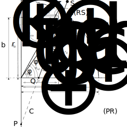

The transformation from ECEF (Earth Centered Earth Fixed) coordinates to geodetic coordinates is a well-known problem in geodesy.
The rough transformation could be done by using $\arctan$ function, assuming that the Earth is a sphere.
However, for the realistic transformation, the Earth should be approximated by a spheroid, and the transformation in this case is not trivial.

## ECEF Coordinate System and Geodetic Coordinate System

Let us first think about a point $\bm{r}_\mathrm{site}$ on the Earth surface.
The Earth is approximated by a spheroid, which is axi-symmetric around the Earth rotation axis and slightly squashed in the north-south direction.
Thus, a point on the Earth surface can be described by Eq. (1).

$$
\begin{gather}
\boldsymbol{r}_\mathrm{site} = \left[ \begin{array}{c}
R_\oplus \cos\varphi_\mathrm{rd} \cos\lambda \\
R_\oplus \cos\varphi_\mathrm{rd} \sin\lambda \\
b_\oplus \sin\varphi_\mathrm{rd} \end{array} \right]
\end{gather}
$$


_Figure 1: Spheroidal Earth Geometry and Geodetic Coordinate Parameters._

On the other hand, $\bm{r}_\mathrm{site}$ can be described as Eq. (2), and it should be possible to write $r_\mathrm{site}$ as a function of $\varphi_\mathrm{gc}$.

$$
\begin{gather}
\boldsymbol{r}_\mathrm{site} = \left[ \begin{array}{c}
r_\mathrm{site} \cos\varphi_\mathrm{gc} \cos\lambda \\
r_\mathrm{site} \cos\varphi_\mathrm{gc} \sin\lambda \\
r_\mathrm{site} \sin\varphi_\mathrm{gc} \end{array} \right]
\end{gather}
$$

Comparing Eq. (1) and Eq. (2), the following relationship can be found betwen $\varphi_\mathrm{rd}$ and $\varphi_\mathrm{gc}$.

$$
\begin{gather}
\tan \varphi_\mathrm{gc} = \frac{b_\oplus}{R_\oplus} \tan \varphi_\mathrm{rd}
\end{gather}
$$

The next step is to find the relationship between $\varphi_\mathrm{rd}$ and $\varphi_\mathrm{gd}$.
The tangential directions at the point $\bm{r}_\mathrm{site}$ can be specified by differentiating $\bm{r}_\mathrm{site}$ with respect to $\varphi_\mathrm{rd}$ and $\lambda$.

$$
\begin{align}
\frac{d}{d\varphi_\mathrm{rd}} \boldsymbol{r}_\mathrm{site} &= \left[ \begin{array}{c}
-R_\oplus \sin\varphi_\mathrm{rd} \cos\lambda \\
-R_\oplus \sin\varphi_\mathrm{rd} \sin\lambda \\
b_\oplus \cos\varphi_\mathrm{rd} \end{array} \right], \\
\frac{d}{d\lambda} \boldsymbol{r}_\mathrm{site} &=
\left[ \begin{array}{c}
-R_\oplus\cos\varphi_\mathrm{rd} \sin\lambda \\
+R_\oplus\cos\varphi_\mathrm{rd} \cos\lambda \\
0
\end{array} \right]. \\
\end{align}
$$

From the above equations, the normal direction at the point $\bm{r}_\mathrm{site}$ can be obtained by

$$
\begin{gather}
\boldsymbol{n} = \left[ \begin{array}{c}
b_\oplus \cos\varphi_\mathrm{rd} \cos\lambda \\
b_\oplus \cos\varphi_\mathrm{rd} \sin\lambda \\
R_\oplus \sin\varphi_\mathrm{rd}
\end{array} \right]
\end{gather}
$$

Based on the normal direction, the relationship between reduced latitude $\varphi_\mathrm{rd}$ and geodetic latitude $\varphi_\mathrm{gd}$ can be obtained.

$$
\begin{gather}
\tan \varphi_\mathrm{gd} = \frac{R_\oplus}{b_\oplus} \tan \varphi_\mathrm{rd}
\end{gather}
$$

From Eq. (3) and Eq. (7), the geocentric latitude $\varphi_\mathrm{gc}$ can be described by using the geodetic latitude $\varphi_\mathrm{gd}$.

$$
\begin{gather}
\tan \varphi_\mathrm{gc} = \frac{b_\oplus^2}{R_\oplus^2} \tan \varphi_\mathrm{gd}
\end{gather}
$$

In this way, the transformation from geocentric parameters to geodetic parameters can be performed on the surface of the Earth.
However, as we are interested in the transformation of the on-orbit satellite position $(x, y, z)$ to the geodetic parameters, some additional steps are required.
Now, the goal is to describe $(x, y, z)$ with the geodetic parameters and then reversly solve the relation.

$$
\begin{align}
\left[ \begin{array}{c} x \\ y \\ z \end{array} \right] =
\left[ \begin{array}{c}
    (C_\oplus + h_\mathrm{ellp}) \cos\varphi_\mathrm{gd} \cos\lambda \\
    (C_\oplus + h_\mathrm{ellp}) \cos\varphi_\mathrm{gd} \sin\lambda \\
    (S_\oplus + h_\mathrm{ellp}) \sin\varphi_\mathrm{gd}
\end{array} \right]
\end{align}
$$

As $(x, y, z)$ coordinates can be described by Eq. (9), we should specify the parameters $C_\oplus$ and $S_\oplus$.

$$
\begin{align}
r_\delta
&= r_\mathrm{site} \cos \varphi_\mathrm{gc}
= R_\oplus \cos \varphi_\mathrm{rd}
= C_\oplus \cos \varphi_\mathrm{gd} \\
r_\mathrm{k}
&= r_\mathrm{site} \sin \varphi_\mathrm{gc}
% = R_\oplus \frac{b_\oplus}{R_\oplus}\sin \varphi_\mathrm{rd}
= R_\oplus \sqrt{1-e_\oplus^2}\sin \varphi_\mathrm{rd}
= S_\oplus \sin \varphi_\mathrm{gd}
\end{align}
$$

In these equations, $\cos \varphi_\mathrm{rd}$ is still unknown.
From the following relations, $\cos \varphi_\mathrm{rd}$ can be expressed by $\varphi_\mathrm{gd}$.

$$
\begin{align}
&\tan^2\varphi_\mathrm{gd} = \frac{R_\oplus^2}{b_\oplus^2} \left(\frac{1}{\cos^2\varphi_\mathrm{rd}} - 1 \right) \\
&\frac{1}{\cos^2\varphi_\mathrm{rd}} = \frac{b_\oplus^2}{R_\oplus^2} \tan^2\varphi_\mathrm{gd} + 1 \\
&\cos\varphi_\mathrm{rd} = \frac{1}{\sqrt{\frac{b_\oplus^2}{R_\oplus^2} \tan^2\varphi_\mathrm{gd} + 1}}, \quad \mathrm{where} \quad -\frac{\pi}{2} \le \varphi_\mathrm{rd} \le \frac{\pi}{2}
\end{align}
$$

Then, $C_\oplus$ and $S_\oplus$ can be expressed by the following formula.

$$
\begin{align}
C_\oplus &= \frac{R_\oplus}{\cos\varphi_\mathrm{gd}} \frac{1}{\sqrt{\frac{b_\oplus^2}{R_\oplus^2} \tan^2\varphi_\mathrm{gd} + 1}}
= \frac{R_\oplus}{\sqrt{\frac{b_\oplus^2}{R_\oplus^2} \sin^2\varphi_\mathrm{gd} + \cos^2\varphi_\mathrm{gd}}} \notag \\
&= \frac{R_\oplus}{\sqrt{(1-e_\oplus^2) \sin^2\varphi_\mathrm{gd} + \cos^2\varphi_\mathrm{gd}}}
= \frac{R_\oplus}{\sqrt{1 - e_\oplus^2 \sin^2\varphi_\mathrm{gd}}}
\end{align}
$$

$$
\begin{equation}
S_\oplus = \frac{R_\oplus(1-e_\oplus^2)}{\sqrt{1 - e_\oplus^2 \sin^2 \varphi_{\mathrm{gd}}}}
\end{equation}
$$

## Numerical Transformation

As the relationship between geodetic coordinates and ECEF coordinates is clarified, we proceed to the actual transformation.
The reference spheroid is WGS84, the shape of which is specified by the semi-major axis $R_\oplus$ and the flattening $f_\oplus$.

$$
\begin{gather}
R_\oplus = 6378.137~\mathrm{km}, \quad
f_\oplus = \frac{1}{298.257223563}
\end{gather}
$$

The other parameters are calculated as follows.

$$
\begin{align}
e_\oplus &= \sqrt{2f_\oplus - f_\oplus^2} = 0.0818191908426215, \\
b_\oplus &= R_\oplus \sqrt{1-e_\oplus^2} = R_\oplus(1-f_\oplus) = 6356.75231424518~\mathrm{km}. \\
\end{align}
$$

The longitude is simply calculated by

$$
\begin{gather}
\lambda = \arctan2 (y,x)
\end{gather}
$$

Regarding the geodetic latitude and altitude, it seems difficult to find the explicit analytic solution.
Thus, we try to find the solution by using a numerical method.
If we know the geodetic latitude $\varphi_\mathrm{gd}$, the altitude $h_\mathrm{ellp}$ can be calculated by

$$
\begin{align}
h_\mathrm{ellp} &= \frac{\sqrt{x^2+y^2}}{\cos\varphi_\mathrm{gd}} - C_\oplus
= \frac{\sqrt{x^2+y^2}}{\cos\varphi_\mathrm{gd}} - \frac{R_\oplus}{\sqrt{1 - e_\oplus^2 \sin^2\varphi_\mathrm{gd}}} \\
h_\mathrm{ellp} &= \frac{z}{\sin\varphi_\mathrm{gd}} - S_\oplus
= \frac{z}{\sin\varphi_\mathrm{gd}} - \frac{R_\oplus(1-e_\oplus^2)}{\sqrt{1 - e_\oplus^2 \sin^2 \varphi_{\mathrm{gd}}}}
\end{align}
$$

To make the above equations equal, we should find the geodetic latitude $\varphi_\mathrm{gd}$ which satisfies the following equation.

$$
\begin{gather}
z - \sqrt{x^2+y^2} \tan \varphi_\mathrm{gd} + \frac{e_\oplus^2 R_\oplus \sin\varphi_\mathrm{gd}}{\sqrt{1 - e_\oplus^2 \sin^2 \varphi_{\mathrm{gd}}}} = 0
\end{gather}
$$

$$
\begin{gather}
\varphi_0 = \arctan \left( \frac{z}{\sqrt{x^2 + y^2}} \right)
\end{gather}
$$

For the initial value, we can use the geocentric latitude.
As an example, the following python script shows the transformation from ECEF coordinates to geodetic coordinates.

```python
# WGS84 parameters
flattening = 1/298.257223563
semimajor = 6378.137
eccentricity = np.sqrt(2*flattening - flattening**2)

def geodetic_latitude(x, y, z):
    """ calculate the geodetic latitude

    # Args:
        x(ndarray): x coordinate in ECEF, km
        y(ndarray): y coordinate in ECEF, km
        z(ndarray): z coordinate in ECEF, km

    # Returns:
        latitude(ndarray): geodetic latitude, rad
    """
    params = (x, y, z)
    latitude = np.arctan(z/ np.sqrt(x**2 + y**2))
    return optimize.fsolve(latitude_equation, latitude, args=params)

def latitude_equation(x: np.ndarray, *args) -> np.ndarray:
    """ equation to be solved

    # Args:
        *args(tuple): (x, y, z)

    # Returns:
        latitude(ndarray): latitude
    """
    return args[2] - np.sqrt(args[0]**2 + args[1]**2) * np.tan(x) + eccentricity**2 * semimajor * np.sin(x) / np.sqrt(1 - eccentricity**2 * np.sin(x)**2)
```

Now, we understand the basics of the conversion from ECEF coordinates to geodetic parameters.
However, this numerical method requires a considerable amount of computation as the amount of data increases.
Therefore, we would like to use a more efficient method to calculate the geodetic parameters.

## Vermeille's Method

One of the more efficient methods is the method proposed by Vermeille [[2]](#reference).
In this method, the solution can be obtained analytically, by using quite technical parameter transformations.

First, we define the following variable $k > 0$.

$$
\begin{align}
&k = \frac{QS}{PR} = \frac{h_\mathrm{ellp} + C_\oplus - e_\oplus^2 C_\oplus}{C_\oplus} \\
&h_\mathrm{ellp} = (k + e_\oplus^2 - 1) C_\oplus = k C_\oplus - S_\oplus
\end{align}
$$

Next, we describe $C_\oplus$ by using $k$.

$$
\begin{align}
\sin\varphi_\mathrm{gd} = \frac{z}{S_\oplus + h_\mathrm{ellp}}
= \frac{z}{k C_\oplus}
\end{align}
$$

$$
\begin{align}
C_\oplus^2 &= \frac{R_\oplus^2}{(1 - e_\oplus^2 \sin^2\varphi_\mathrm{gd})} = R_\oplus^2 + C_\oplus^2 e_\oplus^2 \sin^2\varphi_\mathrm{gd} \notag \\
&= R_\oplus^2 + \frac{e_\oplus^2 z^2}{k^2}
\end{align}
$$

Using the above equation, we re-write $x^2 + y^2$.

$$
\begin{align}
x^2 + y^2
&=(h_\mathrm{ellp} + C_\oplus)^2 \cos^2\varphi_\mathrm{gd}
= (k + e_\oplus)^2 C_\oplus^2 (1 - \sin^2\varphi_\mathrm{gd}) \notag \\
&=(k + e_\oplus)^2 C_\oplus^2 \left( 1 - \frac{z^2}{k^2 C_\oplus^2} \right) \notag \\
&=(k + e_\oplus)^2 \left( R_\oplus^2 + \frac{e_\oplus^2 z^2}{k^2} - \frac{z^2}{k^2}\right)
\end{align}
$$

$$
\begin{align}
\frac{x^2+y^2}{(k+e_\oplus^2)^2} + \frac{(1 - e_\oplus^2) z^2}{k^2} = R_\oplus^2
\end{align}
$$

Now, we define the following variables $p$ and $q$.

$$
\begin{align}
p = \frac{x^2 + y^2}{R_\oplus^2}, \quad q = \frac{1-e_\oplus^2}{R_\oplus^2} z^2
\end{align}
$$

Using these variables, we can formulate the 4th order polynomial equation (quartic equation) for $k$.
In general, quartic equations can be solved analytically, such as by using Ferrari's method.
Vermeille's method does not apply Ferrari's method directly, but uses some similar transformations to find the factorized form.

$$
\begin{align}
k^4 + 2e_\oplus^2 k^3 - (p+q-e_\oplus^4) k^2 - 2e_\oplus^2 q k - e_\oplus^4 q = 0
\end{align}
$$

Now, we introduce a new variable $u$. For any $u$, the following equation holds.

$$
\begin{align}
(k^2 + e_\oplus^2 k - u)^2 - \left[ (p+q-2u) k^2 + 2e_\oplus^2(q-u)k + u^2 + e_\oplus^4 q \right] = 0
\end{align}
$$

In Eq. (33), the inside of $\left[ \cdots \right]$ is a quadratic polynomial with respect to $k$.
If we require that discriminant of this part equals zero, the condition of Eq. (34) is obtained.
If this condition is satisfied, the quadratic polynomial can be factorized into the form of $(\cdots)^2$, and then the entire equation can be factorized as well.

$$
\begin{align}
e_\oplus^4 (q-u)^2 - (p+q-2u)(u^2 + e_\oplus^4 q) = 0
\end{align}
$$

$$
\begin{align}
2u^3 - (p + q - e_\oplus^4) u^2 + e_\oplus^4 pq = 0
\end{align}
$$

Additionally, we introduce the following variables $r$ and $s$.

$$
\begin{align}
r = \frac{p+q-e_\oplus^4}{6}, \quad s = e_\oplus^4 \frac{pq}{4r^3}
\end{align}
$$

These variables are always positive, because

$$
\begin{align}
p + q = \frac{x^2 + y^2}{R_\oplus^2} + \frac{(1-e_\oplus^2) z^2}{R_\oplus^2}
= \frac{x^2}{R_\oplus^2} + \frac{y^2}{R_\oplus^2} + \frac{z^2}{b_\oplus^2} > 1
\end{align}
$$

Then, the cubic equation with respect to $u/r$ can be obtained.

$$
\begin{align}
\frac{u^3}{r^3} - 3\frac{u^2}{r^2} - 2s = 0
\end{align}
$$

We substitute Eq. (38), to obtain the equation with respect to $t$.
In the range of $t > 0$, $1 + t +  1/t$ takes the minimum value of 3 at $t = 1$.
When $t = 1$, the left-hand side of Eq. (37) becomes $-2s < 0$.
Therefore, there should be one solution in the range of $0 < t < 1$, and another solution in the range of $t > 1$.

$$
\begin{align}
\frac{u}{r} = 1 + t + \frac{1}{t}
\end{align}
$$

$$
\begin{gather}
t^6 - 2(1+s)t^3 + 1 = 0
\end{gather}
$$

Focusing on real values, the following two solutions can be found.
As expected, one solution is in the range of $0 < t < 1$, and the other is in the range of $t > 1$.

$$
\begin{align}
t^3 &= 1 + s \pm \sqrt{s(2+s)} \\
t &= \sqrt[3]{1 + s \pm \sqrt{s(2+s)}}
\end{align}
$$

Regardless of which solution is chosen, the value of $u/r$ will be the same.
So we can choose whichever solution we like. For now, let us choose the solution with plus sign.
The second term in Eq. (33) is expressed in the square form.

$$
\begin{align}
(k^2 + e_\oplus^2 k - u)^2 - \left( e_\oplus^2 \frac{q-u}{v}k + v \right)^2 = 0, \quad
\mathrm{where}\quad v = \sqrt{u^2 + e_\oplus^4 q}
\end{align}
$$

$$
\begin{align}
\left( k^2 + \frac{v-u+q}{v}e_\oplus^2k + v - u\right)\left( k^2 + \frac{v-u+q}{v}e_\oplus^2k - v - u\right) = 0
\end{align}
$$

The first bracket in Eq. (44) has no solution for $k>0$, because $v-u$, $v$, and $q$ are all positive.
So we are interested in the second bracket.
Since $u+v$ is positive, there is only one solution for $k>0$.

$$
\begin{gather}
k = \sqrt{u+v+w^2} - w, \quad \mathrm{where} \quad w = e_\oplus^2\frac{u+v-q}{2v}
\end{gather}
$$

As $k$ has been determined, we can calculate the geodetic latitude $\varphi_\mathrm{gd}$ and the altitude $h_\mathrm{ellp}$.

$$
\begin{equation}
D = \frac{k\sqrt{x^2+y^2}}{k+e_\oplus^2}, \quad
C_\oplus = \frac{\sqrt{D^2+z^2}}{k}
\end{equation}
$$

$$
\begin{equation}
h_\mathrm{ellp} = \frac{k+e_\oplus^2-1}{k}, \quad
\varphi_\mathrm{gd} = 2 \arctan \frac{z}{D+\sqrt{D^2+z^2}}
\end{equation}
$$

The original paper [[2]](#reference) lists the minimum equations required for the conversion.
By writing a simple script based on these equations, we can convert from ECEF coordinates to geodetic parameters.

```python
# WGS84 parameters
flattening = 1/298.257223563
semimajor = 6378.137
eccentricity = np.sqrt(2*flattening - flattening**2)

def geodetic_vermeille(x, y, z):
    """ calculate the geodetic latitude and altitude based on
    H. Vermeille, "Direct transformation from geocentric to geodetic coordinates", 2002, Journal of Geodesy, 76:451-454

    # Args:
        x(ndarray): x coordinate in ECEF, km
        y(ndarray): y coordinate in ECEF, km
        z(ndarray): z coordinate in ECEF, km

    # Returns:
        lat(ndarray): geodetic latitude, rad
        lon(ndarray): geodetic longitude, rad
        h(ndarray): geodetic altitude, km
    """
    p = (x**2 + y**2)/semimajor**2
    q = (1 - eccentricity**2) * z**2 / semimajor**2
    r = (p + q - eccentricity**4)/6
    s = eccentricity**4 * p * q / (4 * r**3)
    t = (1 + s + np.sqrt(s * (2 + s)))**(1/3)
    u = r * (1 + t + 1/t)
    v = np.sqrt(u**2 + eccentricity**4 * q)
    w = eccentricity**2 * (u + v - q)/(2 * v)
    k = np.sqrt(u + v + w**2) - w
    D = k * np.sqrt(x**2 + y**2)/(k + eccentricity**2)
    lat = 2 * np.arctan(z/(D+np.sqrt(D**2 + z**2)))
    lon = np.arctan2(y, x)
    h = (k + eccentricity**2 - 1)/k * np.sqrt(D**2 + z**2)
    return lat, lon, h
```

## Reference

1. David A. Vallado, Fundamentals of Astrodynamics and Applications Fourth Edition, 2013, Microsoft Press
2. H. Vermeille, “Direct transformation from geocentric to geodetic coordinates”, 2002, Journal of Geodesy, 76:451-454, doi: [10.1007/s00190-002-0273-6](https://doi.org/10.1007/s00190-002-0273-6).
