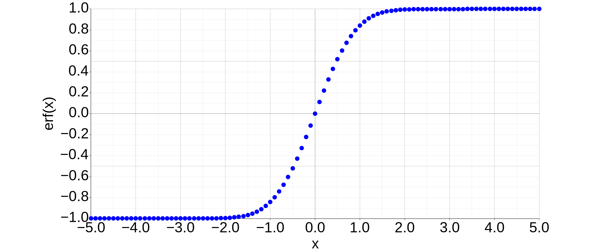

In the previous article, we derived the [Hertz-Knudsen Equation](https://thermocraft.space/articles/hertz-knudsen/), which describes the mass flux due to evaporation and condensation.
However, the equation contains two unknown parameters: the condensation coefficient $\sigma_c$ and the evaporation coefficient $\sigma_e$, which makes it inconvenient for practical use.
Schrage modified the Hertz-Knudsen Equation by adding an average velocity component to the Maxwell-Boltzmann distribution [[1]](#references).
In this article, we will follow Schrage's approach to derive the Hertz-Knudsen-Schrage Equation.

## Modification of the Hertz-Knudsen Equation

We assume that the velocity distribution follows the Maxwell-Boltzmann distribution, but with an additional average velocity component $\overline{v}_z$ in the z-direction.
The number of particles colliding with the liquid-vapor interface (per unit time and unit area) can be estimated as follows.

$$
\begin{align}
% \label{eq:velocity_distribution}
\nu_z &= \int_{-\infty}^{\infty} \int_{-\infty}^{\infty} \int_{-\infty}^{0}
\frac{N}{V} \left( \frac{m}{2\pi k_\mathrm{B} T} \right)^{\frac{3}{2}}
\exp \left[ -\frac{m(v_x^2 + v_y^2 + (v_z - \overline{v}_z)^2)}{2k_\mathrm{B}T} \right]
|v_z|~dv_x dv_y dv_z \notag \\
&= - \frac{N}{V} \sqrt{\frac{m}{2\pi k_\mathrm{B} T}} \int_{-\infty}^{0}
\exp \left[ -\frac{m (v_z - \overline{v}_z)^2}{2k_\mathrm{B}T} \right] v_z~dv_z
\end{align}
$$

The integral with respect to $w = v_z - \overline{v}_z$ can be evaluated as follows.

$$
\begin{align}
&\int_{-\infty}^{-\overline{v}_z} (w + \overline{v}_z)
\exp \left[ -\frac{m w^2}{2k_\mathrm{B}T} \right]dw \notag \\
&= \int_{-\infty}^{-\overline{v}_z} w
\exp \left[ -\frac{m w^2}{2k_\mathrm{B}T} \right]dw + \overline{v}_z \int_{-\infty}^{-\overline{v}_z}
\exp \left[ -\frac{m w^2}{2k_\mathrm{B}T} \right]dw \notag \\
&= - \frac{k_\mathrm{B}T}{m}
\left[ \exp \left[ -\frac{m w^2}{2k_\mathrm{B}T} \right] \right]_{-\infty}^{-\overline{v}_z} + \overline{v}_z \int_{-\infty}^{0}
\exp \left[ -\frac{m w^2}{2k_\mathrm{B}T} \right]dw + \overline{v}_z \int^{-\overline{v}_z}_{0} \exp \left[ -\frac{m w^2}{2k_\mathrm{B}T} \right]dw \notag \\
&= - \frac{k_\mathrm{B}T}{m} \exp \left[- \frac{m \overline{v}_z^2}{2k_\mathrm{B}T} \right]
+ \frac{\overline{v}_z}{2} \sqrt{\frac{2\pi k_\mathrm{B}T}{m}} - \overline{v}_z \int^{\overline{v}_z}_{0} \exp \left[ -\frac{m w^2}{2k_\mathrm{B}T} \right]dw \notag \\
&= - \frac{k_\mathrm{B}T}{m} \exp \left[ -\frac{m \overline{v}_z^2}{2k_\mathrm{B}T} \right] + \frac{\overline{v}_z}{2} \sqrt{\frac{2\pi k_\mathrm{B}T}{m}}
\left[1 - \mathrm{erf} \left( \overline{v}_z \sqrt{\frac{m}{2k_\mathrm{B}T}} \right) \right]
\end{align}
$$

erf(x) is the error function, defined as shown in (3), and the shape of the function is shown in Figure 1.

$$
\begin{equation}
% \label{eq:erf}
\mathrm{erf}(x) = \frac{2}{\sqrt{\pi}} \int^x_0 \exp \left[ -t^2 \right] dt
\end{equation}
$$

_Figure 1: Error Function._

Substituting $t = a t'$, we can rewrite it in a form that includes an additional parameter $a$.

$$
\begin{equation}
% \label{eq:erfa}
\mathrm{erf}(x) = \frac{2 a}{\sqrt{\pi}} \int^{\frac{x}{a}}_0 \exp \left[ -(a t')^2 \right] dt'
\end{equation}
$$

As a result, the mass flux impinging on the liquid-vapor interface is expressed as follows.

$$
\begin{align}
&j = m \nu_z \notag \\
&= - \frac{mN}{V} \sqrt{\frac{m}{2\pi k_\mathrm{B} T}} \left\{
- \frac{k_\mathrm{B}T}{m} \exp \left[ -\frac{m \overline{v}_z^2}{2k_\mathrm{B}T} \right]
- \frac{\overline{v}_z}{2} \sqrt{\frac{2\pi k_\mathrm{B}T}{m}}
\left[1 - \mathrm{erf} \left( \overline{v}_z \sqrt{\frac{m}{2k_\mathrm{B}T}} \right) \right] \right\} \notag \\
&= \frac{N k_\mathrm{B}T}{V}
\sqrt{\frac{m}{2\pi k_\mathrm{B} T}} \exp \left[ -\frac{m \overline{v}_z^2}{2k_\mathrm{B}T} \right] - \frac{\overline{v}_z mN}{2V}
\left[1 - \mathrm{erf} \left( \overline{v}_z \sqrt{\frac{m}{2k_\mathrm{B}T}} \right) \right] \notag \\
&= P \frac{\beta}{\sqrt{\pi}} \exp \left[- \overline{v}_z^2 \beta^2 \right]
- P \overline{v}_z \beta^2 \left[ 1 - \mathrm{erf}(\overline{v}_z \beta) \right] \notag \\
&= \frac{\beta P}{\sqrt{\pi}} \left\{ \exp \left[- \overline{v}_z^2 \beta^2 \right] - \overline{v}_z \beta \sqrt{\pi} \left[ 1 - \mathrm{erf}(\overline{v}_z \beta) \right] \right\} \notag \\
&= \frac{\beta P}{\sqrt{\pi}} ~ \Gamma \left( \overline{v}_z \beta \right)
% = \frac{\rho}{2\sqrt{\pi} \beta} ~ \Gamma \left( \overline{v}_z \beta \right)
\end{align}
$$

The parameters $\beta$ and $\Gamma$ are defined as shown below.
The parameter $m$ is the mass of a single molecule, and the molar mass is given by $M = m N_\mathrm{A}$, where $N_\mathrm{A}$ is Avogadro's number.
$R$ is the molar gas constant, satisfying $R = k_\mathrm{B} N_\mathrm{A}$.

$$
\begin{equation}
\beta = \sqrt{\frac{m}{2k_\mathrm{B}T}} = \sqrt{\frac{M}{2RT}}
\end{equation}
$$

$$
\begin{equation}
\Gamma \left( \overline{v}_z \beta \right) = \exp \left[ - \overline{v}_z^2 \beta^2 \right]
- \overline{v}_z \beta \sqrt{\pi} \left[ 1 - \mathrm{erf} \left( \overline{v}_z \beta \right) \right]
\end{equation}
$$

We denote the flux colliding from the vapor side to the liquid-vapor interface as $j_v$, and the flux colliding from the liquid side to the liquid-vapor interface as $j_l$.
For the liquid side, we assume there is no offset in the average velocity, and use the mass flux expression obtained when deriving the [Hertz-Knudsen Equation](https://thermocraft.space/articles/hertz-knudsen/).

$$
\begin{equation}
j_v = \frac{\beta_v P}{\sqrt{\pi}} \Gamma = \sqrt{\frac{m}{2\pi k_\mathrm{B}}} \frac{\Gamma P_v}{\sqrt{T_v}}
\end{equation}
$$

$$
\begin{equation}
j_l = \sqrt{\frac{m}{2\pi k_\mathrm{B}}} \frac{P_l}{\sqrt{T_l}}
\end{equation}
$$

We assume that there is a non-zero average velocity only on the vapor side for the following reasons:

- Since the number of molecules per unit volume is significantly large on the liquid side, the average velocity on the liquid side is considered to be sufficiently small compared to the vapor side.
- Since the number of molecules per unit volume is significantly large on the liquid side, the [mean free path](https://thermocraft.space/articles/knudsen-number/) is very small, allowing us to ignore non-equilibrium regions.

The ratio of molecules, that actually condense or evaporate upon colliding with the liquid-vapor interface, is denoted as $\alpha$ (assumed to be the same in both directions).
Then, the overall mass flux can be expressed as $j^{LV} = \alpha (j_l - j_v)$.
Substituting (8) and (9) into this relation, we obtain the Hertz-Knudsen-Schrage Equation as shown below.

$$
\begin{equation}
% \label{eq:schrage}
j^{LV} = \alpha \sqrt{\frac{m}{2\pi k_\mathrm{B}}}\left( \frac{P_l}{\sqrt{T_l}} - \frac{\Gamma P_v}{\sqrt{T_v}} \right)
\end{equation}
$$

Meanwhile, the following relationship should also hold between the mass flux $j^{LV}$ and the average velocity $\overline{v}_z$.

$$
\begin{equation}
% \label{eq:Schrage1953_3.1-14}
j^{LV} = \rho_v \overline{v}_z
\end{equation}
$$

Since $\Gamma(\overline{v}_z \beta)$ is a nonlinear function of $\overline{v}_z$ as shown in (7), it is not possible to explicitly determine the mass flux $j^{LV}$, when the temperature and pressure of the liquid and vapor phases are given.

## Moderate Evaporation and Condensation

If the evaporation or condensation is moderate, where the average velocity is sufficiently small, (10) can be further transformed to the explicit form.
If $\overline{v}_z \beta_v$ is sufficiently small, $\Gamma$ can be approximated as follows.

$$
\begin{equation}
% \label{eq:gamma}
\Gamma ( \overline{v}_z \beta_v ) \simeq 1 - \overline{v}_z \beta_v \sqrt{\pi}
\end{equation}
$$

$\overline{v}_z \beta_v$ in this equation can be transformed as follows.

$$
\begin{equation}
% \label{eq:Schrage1953_3.1-15}
\overline{v}_z \beta_v
= \frac{1}{2 \sqrt{\pi}} \frac{j^{LV}}{j_l} \frac{\sqrt{T_v}}{\sqrt{T_l}} \frac{P_l}{P_v}
\end{equation}
$$

The relation of (13) can be confirmed as follows.

$$
\begin{align}
&\frac{1}{2 \sqrt{\pi}} \frac{j^{LV}}{j_l} \frac{\sqrt{T_v}}{\sqrt{T_l}} \frac{P_l}{P_v}
= \frac{1}{2 \sqrt{\pi}} \frac{\rho_v \overline{v}_z}{\sqrt{\frac{m}{2\pi k_\mathrm{B}}} \frac{P_l}{\sqrt{T_l}}} \frac{\sqrt{T_v}}{\sqrt{T_l}} \frac{P_l}{P_v} \notag \\
&= \frac{1}{2 \sqrt{\pi}} \frac{\frac{m P_v}{k_\mathrm{B}T_v} \overline{v}_z}{\sqrt{\frac{m}{2\pi k_\mathrm{B}}} \frac{P_l}{\sqrt{T_l}}} \frac{\sqrt{T_v}}{\sqrt{T_l}} \frac{P_l}{P_v}
= \overline{v}_z \sqrt{\frac{m}{2 k_\mathrm{B} T_v}}
= \overline{v}_z \beta_v
\end{align}
$$

Substituting (12) and (13) into (10), we can rewrite $j^{LV}$ as follows.

$$
\begin{align}
j^{LV} &= \alpha \sqrt{\frac{m}{2\pi k_\mathrm{B}}}\left\{ \frac{P_l}{\sqrt{T_l}} - \frac{P_v}{\sqrt{T_v}} \left( 1 - \overline{v}_z \beta_v \sqrt{\pi} \right) \right\} \notag \\
&= \alpha \sqrt{\frac{m}{2\pi k_\mathrm{B}}}\left\{ \frac{P_l}{\sqrt{T_l}} - \frac{P_v}{\sqrt{T_v}} \left( 1 - \frac{1}{2} \frac{j^{LV}}{j_l} \frac{\sqrt{T_v}}{\sqrt{T_l}} \frac{P_l}{P_v}  \right) \right\} \notag \\
&= \alpha \sqrt{\frac{m}{2\pi k_\mathrm{B}}}\left( \frac{P_l}{\sqrt{T_l}} - \frac{P_v}{\sqrt{T_v}} \right) + \alpha \sqrt{\frac{m}{2\pi k_\mathrm{B}}} \frac{P_v}{\sqrt{T_v}} \times \frac{1}{2} \frac{j^{LV}}{j_l} \frac{\sqrt{T_v}}{\sqrt{T_l}} \frac{P_l}{P_v} \notag \\
&= \alpha \sqrt{\frac{m}{2\pi k_\mathrm{B}}}\left( \frac{P_l}{\sqrt{T_l}} - \frac{P_v}{\sqrt{T_v}} \right) + \frac{\sqrt{\frac{m}{2\pi k_\mathrm{B}}} \frac{P_v}{\sqrt{T_v}}}{\sqrt{\frac{m}{2\pi k_\mathrm{B}}} \frac{P_l}{\sqrt{T_l}}} \times \frac{\alpha}{2} j^{LV} \frac{\sqrt{T_v}}{\sqrt{T_l}} \frac{P_l}{P_v} \notag \\
&= \alpha \sqrt{\frac{m}{2\pi k_\mathrm{B}}}\left( \frac{P_l}{\sqrt{T_l}} - \frac{P_v}{\sqrt{T_v}} \right) + \frac{\alpha}{2} j^{LV}
\end{align}
$$

$$
\begin{equation}
\left( 1- \frac{\alpha}{2} \right) j^{LV} = \alpha \sqrt{\frac{m}{2\pi k_\mathrm{B}}}\left( \frac{P_l}{\sqrt{T_l}} - \frac{P_v}{\sqrt{T_v}} \right)
\end{equation}
$$

Finally, we obtain the following relation, which is also called the Hertz-Knudsen-Schrage Equation.

$$
\begin{gather}
% \label{eq:schrage2}
j^{LV} = \frac{2 \alpha}{2 - \alpha} \sqrt{\frac{m}{2\pi k_\mathrm{B}}}\left( \frac{P_l}{\sqrt{T_l}} - \frac{P_v}{\sqrt{T_v}} \right)
\end{gather}
$$

The Hertz-Knudsen-Schrage equation is cited occasionally in books and papers as a relatively simple tool for modeling evaporation and condensation.
Looking at equation (1), we can see that the Maxwell-Boltzmann distribution is modified using the average velocity component.
It is true that certain amount of mass is moving with an average velocity when evaporation or condensation is occurring.
However, there is no clear physical justification for expressing the velocity distribution of molecules in the form of (1).
It is important to note that this is an assumption to simply handle the velocity distribution of molecules.

## References

1. Robert W. Schrage, "A theoretical study of interphase mass transfer", Columbia University Press, 1953, doi: [10.7312/schr90162](https://doi.org/10.7312/schr90162)
