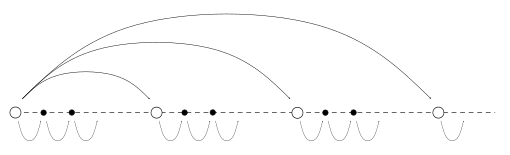

## Introduction

For Monte Carlo simulations, typically it is not necessary to exchange data between each execution, so parallelizing the calculations can lead to efficient simulations, especially when using a GPU.
To implement Monte Carlo simulations as a web application using GPU, a possible approach is to use WebGL2.
However, since there is no built-in random number generator on OpenGL ES 3.0, we need to implement our own random number generator.

Basically, random number generation (RNG) algorithms sequentially generate values starting from an initial seed, so some trick is needed to parallelize this process.
The simplest approach is that each computation thread first skips ahead to different points in the sequence, and then generates values one by one from there (Figure 1).
To achieve this, we need an efficient skip algorithm as well as an algorithm for sequentially generating values.


_Figure 1: Idea of Parallel Random Number Generation._

In this article, we introduce one of the common RNG algorithms for parallel computation: MRG32k3a.
Based on the papers by L'Ecuyer [[2]](#references) and [[3]](#references), we will review the outline of the algorithm and how to implement it on WebGL2.

## MRG32k3a

Multiple Recursive Generator (MRG) is a type of RNG algorithm that updates the state by calculating a linear combination of past states, as shown in Eq. (1).

$$
\begin{equation}
x_n = (a_1 x_{n-1} + \cdots + a_k x_{n-k}) \quad \mathrm{mod}~m
\end{equation}
$$

The idea of MRG32k3a is to use multiple MRGs to achieve a longer period and better random characteristics.
As shown in Eq. (2), MRG32k3a generates random numbers sequentially.

$$
\begin{align}
&x_{1,n} = (1403580 \times x_{1,n-2} - 810728 \times x_{1,n-3})\quad\mathrm{mod}~m_1 \\
&x_{2,n} = (527612 \times x_{2,n-1} - 1370589 \times x_{2,n-3})\quad\mathrm{mod}~m_2 \\
&z_n = (x_{1,n} - x_{2,n})\quad\mathrm{mod}~m_1 \\
\end{align}
$$

where

$$
\begin{align}
m_1 = 2^{32} - 209 = 4294967087, \quad
m_2 = 2^{32} - 22853 = 4294944443 \notag
\end{align}
$$

Implementation of this algorithm is trickier than it looks.
On OpenGL ES 3.0, we can only use 32-bit integers, and since we need to use the full 32 bits, multiplication (also addition) can easily lead to overflow.
Therefore, we need to be careful about overflow when implementing multiplication, addition, and modulo operations correctly.
To calculate $a \times b$, we can repeatedly add $a$ to itself. But to reduce the number of calculations, we can use a method similar to exponentiation by squaring, checking the modulo at each addition.

```glsl
uint addModM(uint a, uint b, uint m) {
    uint amodm = a % m;
    uint bmodm = b % m;
    uint blim = m - amodm;
    if (bmodm <= blim) {
        return amodm + bmodm;
    }
    else {
        return amodm - (m - bmodm);
    }
}

uint diffModM(uint a, uint b, uint m) {
    uint amodm = a % m;
    uint bmodm = b % m;
    if (amodm >= bmodm) {
        return amodm - bmodm;
    }
    else {
        return amodm + (m - bmodm);
    }
}

uint multModM(uint a, uint b, uint m) {
    uint amodm = a % m;
    uint bmodm = b % m;
    uint res = 0u;
    while (bmodm > 0u) {
        if ((bmodm&0x1u) == 0x1u) {
            res = addModM(res, amodm, m);
        }
        bmodm = bmodm >> 1;
        amodm = addModM(amodm, amodm, m);
    }
    return res;
}
```

Using these functions, we can implement MRG32k3a as shown below.

```glsl
// MRG32k3a parameters
uint[3] x1 = uint[3](0u, 0u, 1234567u);
uint[3] x2 = uint[3](0u, 0u, 1234567u);
const uint m1 = 4294967087u;
const uint m2 = 4294944443u;
const uint a11 = 1403580u;
const uint a10 = 810728u;
const uint a22 = 527612u;
const uint a20 = 1370589u;

uint stepMRG32k3a(void) {
    uint x1i = diffModM(multModM(x1[1], a11, m1), multModM(x1[0], a10, m1), m1);
    uint x2i = diffModM(multModM(x2[2], a22, m2), multModM(x2[0], a20, m2), m2);
    x1[0] = x1[1];
    x1[1] = x1[2];
    x1[2] = x1i;
    x2[0] = x2[1];
    x2[1] = x2[2];
    x2[2] = x2i;
    return diffModM(x1i, x2i, m1);
}
```

## Skip Algorithm of MRG32k3a

Meanwhile, by describing MRG32k3a in matrix form, the one-step forward can be expressed as shown in Eqs. (5) and (6).

$$
\begin{align}
\left( \begin{array}{c} x_{1,n-2} \\ x_{1,n-1} \\ x_{1,n} \end{array} \right) &=
\left( \begin{array}{ccc} 0 & 1 & 0 \\ 0 & 0 & 1 \\ -810728 & 1403580 & 0 \end{array} \right) \notag
\left( \begin{array}{c} x_{1,n-3} \\ x_{1,n-2} \\ x_{1,n-1} \end{array} \right) \\ &=
\left( \begin{array}{ccc} 0 & 1 & 0 \\ 0 & 0 & 1 \\ 4294156359 & 1403580 & 0 \end{array} \right)
\left( \begin{array}{c} x_{1,n-3} \\ x_{1,n-2} \\ x_{1,n-1} \end{array} \right)
\end{align}
$$

$$
\begin{align}
\left( \begin{array}{c} x_{2,n-2} \\ x_{2,n-1} \\ x_{2,n} \end{array} \right) &=
\left( \begin{array}{ccc} 0 & 1 & 0 \\ 0 & 0 & 1 \\ -1370589 & 0 & 527612 \end{array} \right) \notag
\left( \begin{array}{c} x_{2,n-3} \\ x_{2,n-2} \\ x_{2,n-1} \end{array} \right) \\ &=
\left( \begin{array}{ccc} 0 & 1 & 0 \\ 0 & 0 & 1 \\ 4293573854 & 0 & 527612 \end{array} \right)
\left( \begin{array}{c} x_{2,n-3} \\ x_{2,n-2} \\ x_{2,n-1} \end{array} \right)
\end{align}
$$

The one-step backward can also be expressed in a similar way.

$$
\begin{align}
x_{1,n} &= (184888585 \times x_{1,n+1} + 1945170933 \times x_{1,n+3})~\mathrm{mod}~m_1 \\
x_{2,n} &= (360366334 \times x_{2,n+2} + 4225571728 \times x_{2,n+3})~\mathrm{mod}~m_2 \\
&= (360366334 \times x_{2,n+2} - 69372715 \times x_{2,n+3})~\mathrm{mod}~m_2
\end{align}
$$

$$
\begin{equation}
\left( \begin{array}{c} x_{1,n} \\ x_{1,n+1} \\ x_{1,n+2} \end{array} \right) =
\left( \begin{array}{ccc} 184888585 & 0 & 1945170933 \\ 1 & 0 & 0 \\ 0 & 1 & 0 \end{array} \right)
\left( \begin{array}{c} x_{1,n+1} \\ x_{1,n+2} \\ x_{1,n+3} \end{array} \right)
\end{equation}
$$

$$
\begin{equation}
\left( \begin{array}{c} x_{1,n} \\ x_{1,n+1} \\ x_{1,n+2} \end{array} \right) =
\left( \begin{array}{ccc} 0 & 360366334 & 4225571728 \\ 1 & 0 & 0 \\ 0 & 1 & 0 \end{array} \right)
\left( \begin{array}{c} x_{1,n+1} \\ x_{1,n+2} \\ x_{1,n+3} \end{array} \right)
\end{equation}
$$

As we described one-step forward and backward in matrix form, we can skip multiple steps forward or backward by calculating the power of the matrices.
Using the exponentiation by squaring, we can efficiently compute the power of the matrix.

As there is no 2D array in OpenGL ES 3.0 and `mat3` is only available in `float` type, we will use a 1D array of `uint` to represent the matrix calculation.

$$
\begin{equation}
\left[ \begin{array}{ccc} a_0 & a_1 & a_2 \\ a_3 & a_4 & a_5 \\ a_6 & a_7 & a_8 \end{array} \right]
\left[ \begin{array}{ccc} b_0 & b_1 & b_2 \\ b_3 & b_4 & b_5 \\ b_6 & b_7 & b_8 \end{array} \right] =
\left[ \begin{array}{ccc} c_0 & c_1 & c_2 \\ c_3 & c_4 & c_5 \\ c_6 & c_7 & c_8 \end{array} \right]
\end{equation}
$$

$$
\begin{align*}
c_0 &= a_0 b_0 + a_1 b_3 + a_2 b_6 \\
c_1 &= a_0 b_1 + a_1 b_4 + a_2 b_7 \\
c_2 &= a_0 b_2 + a_1 b_5 + a_2 b_8 \\
c_3 &= a_3 b_0 + a_4 b_3 + a_5 b_6 \\
c_4 &= a_3 b_1 + a_4 b_4 + a_5 b_7 \\
c_5 &= a_3 b_2 + a_4 b_5 + a_5 b_8 \\
c_6 &= a_6 b_0 + a_7 b_3 + a_8 b_6 \\
c_7 &= a_6 b_1 + a_7 b_4 + a_8 b_7 \\
c_8 &= a_6 b_2 + a_7 b_5 + a_8 b_8 \\
\end{align*}
$$

```glsl
// calculate c = a*b mod m
void matMultModM(uint[9] a, uint[9] b, uint m, out uint[9] c) {
    c[0] = addModM(addModM(multModM(a[0],b[0],m), multModM(a[1],b[3],m), m), multModM(a[2],b[6],m), m);
    c[1] = addModM(addModM(multModM(a[0],b[1],m), multModM(a[1],b[4],m), m), multModM(a[2],b[7],m), m);
    c[2] = addModM(addModM(multModM(a[0],b[2],m), multModM(a[1],b[5],m), m), multModM(a[2],b[8],m), m);
    c[3] = addModM(addModM(multModM(a[3],b[0],m), multModM(a[4],b[3],m), m), multModM(a[5],b[6],m), m);
    c[4] = addModM(addModM(multModM(a[3],b[1],m), multModM(a[4],b[4],m), m), multModM(a[5],b[7],m), m);
    c[5] = addModM(addModM(multModM(a[3],b[2],m), multModM(a[4],b[5],m), m), multModM(a[5],b[8],m), m);
    c[6] = addModM(addModM(multModM(a[6],b[0],m), multModM(a[7],b[3],m), m), multModM(a[8],b[6],m), m);
    c[7] = addModM(addModM(multModM(a[6],b[1],m), multModM(a[7],b[4],m), m), multModM(a[8],b[7],m), m);
    c[8] = addModM(addModM(multModM(a[6],b[2],m), multModM(a[7],b[5],m), m), multModM(a[8],b[8],m), m);
}
```

Using this function, we implement the matrix exponentiation by squaring.

```glsl
// calculate b = a**n mod m
void matPowModM(uint[9] a, uint n, uint m, out uint[9] b) {
    uint[9] apow = a;
    b = uint[9](1u, 0u, 0u, 0u, 1u, 0u, 0u, 0u, 1u);
    while (n > 0u) {
        if ((n&0x1u) == 0x1u) {
            matMultModM(apow, b, m, b);
        }
        n = n >> 1;
        matMultModM(apow, apow, m, apow);
    }
}
```

Finally, the skip algorithm can be implemented as follows.

```glsl
const uint[9] a1 = uint[9](0u, 1u, 0u, 0u, 0u, 1u, 4294156359u, 1403580u, 0u);
const uint[9] a2 = uint[9](0u, 1u, 0u, 0u, 0u, 1u, 4293573854u, 0u, 527612u);

uint skipMRG32k3a(uint n) {
    uint[9] a1pow;
    uint[9] a2pow;
    matPowModM(a1, n, m1, a1pow);
    matPowModM(a2, n, m2, a2pow);
    matVecMultModM(a1pow, x1, m1, x1);
    matVecMultModM(a2pow, x2, m2, x2);
    return diffModM(x1[0], x2[0], m1);
}
```

## References

1. T. Bradley, J. du Toit, R. Tong, M. Giles, P. Woodhams, Parallelization techniques for random numbers generators, in: GPU Computing Gems, Gems Emerald ed., 2011, pp. 231–246, [10.1016/B978-0-12-384988-5.00016-4](https://doi.org/10.1016/B978-0-12-384988-5.00016-4).
2. Pierre L'Ecuyer, (1999) Good Parameters and Implementations for Combined Multiple Recursive Random Number Generators. Operations Research 47(1):159-164, [10.1287/opre.47.1.159](https://doi.org/10.1287/opre.47.1.159).
3. Pierre L'Ecuyer, Richard Simard, E. Jack Chen, W. David Kelton, (2002) An Object-Oriented Random-Number Package with Many Long Streams and Substreams. Operations Research 50(6):1073-1075, [10.1287/opre.50.6.1073.358](https://doi.org/10.1287/opre.50.6.1073.358).
