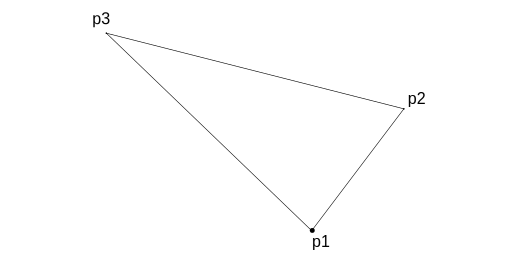
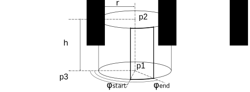
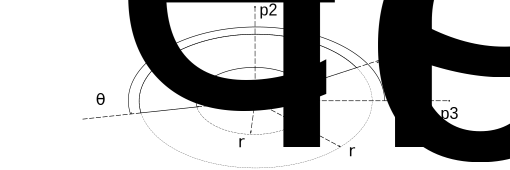
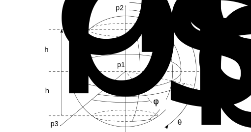

When evaluating the radiative heat exchange, one of the common methodologies is to use ray tracing.
With this method, it is possible to determine radiative couplings (or view factors) between objects.
In this analysis, it is necessary to specify ray origin points on the object surfaces such that they are uniformly distributed over the area, and then the ray directions should be determined according to Lambert's cosine law (assumining diffuse surfaces).
In this article, we discuss how to distribute points uniformly on primitive shapes using random values in the range of 0 to 1.

## Rectangle

The most simple case for uniform point distribution is a rectangle.
To uniformly distribute points on a rectangle, each point can be calculated by Eq. (1) using two random numbers $q_1$ and $q_2$ in the range of [0, 1].
This method can be applicable to parallelograms as well.

$$
\begin{equation}
\vec{p} = q_1 (\vec{p_2} - \vec{p_1}) + q_2 (\vec{p_3} - \vec{p_1})
\end{equation}
$$

_Figure 1: Point Distribution on a Rectangle._

## Triangle

For a triangle, one simple approach is to calculate the point in the same way as a rectangle, using Eq. (1).
To ensure the points are inside the triangle, the sum of the two random values $(q_1, q_2)$ should be less than or equal to 1.
If the sum exceeds 1, the values should be discarded, and new random values should be generated until a valid combination is obtained.

_Figure 2: Point Distribution on a Triangle._

## Cylindrical Surface

For a cylindrical surface, points can be distributed uniformly in both the height and the circumferential direction.
The height $h$ and circumferential parameter $\varphi$ are determined using a random value $q_1$ and $q_2$ as shown in Eq. (2) and Eq. (3), respectively.

$$
\begin{gather}
h = h_\mathrm{max} ~q_1
\end{gather}
$$

$$
\begin{gather}
\varphi = (\varphi_\mathrm{end} - \varphi_\mathrm{start})~ q_2 + \varphi_\mathrm{start}
\end{gather}
$$

_Figure 3: Point Distribution on a Cylindrical Surface._

## Disc

We consider a partial disk as shown in Figure 4.
When distributing points uniformly on a partial disk, the probability $q_1$ of a point falling within the radius of $r$ can be expressed by Eq. (4).

$$
\begin{equation}
q_1 = \frac{\int_{r_\mathrm{inner}}^{r} \int_{\theta_\mathrm{start}}^{\theta_\mathrm{end}} r dr d\theta}{\int_{r_\mathrm{inner}}^{r_\mathrm{outer}} \int_{\theta_\mathrm{start}}^{\theta_\mathrm{end}} r dr d\theta}
= \frac{r^2 - r_\mathrm{inner}^2}{r_\mathrm{outer}^2 - r_\mathrm{inner}^2}
\end{equation}
$$

Solving this equation for $r$ gives us the description of the radial position $r$ as a function of random value $q_1$.

$$
\begin{equation}
r = \sqrt{q_1 (r_\mathrm{outer}^2 - r_\mathrm{inner}^2) + r_\mathrm{inner}^2}
\end{equation}
$$

For the angular direction, the angle $\theta$ can be determined using a random value $q_2$ as shown in Eq. (6).

$$
\begin{equation}
\theta = q_2 (\theta_\mathrm{end} - \theta_\mathrm{start}) + \theta_\mathrm{start}
\end{equation}
$$

_Figure 4: Point Distribution on a Disk._

## Spherical Surface

We consider a partial spherical surface as shown in Figure 5.
When distributing points uniformly on a spherical surface, the probability $q$ that a point is below a polar angle of $\theta$ can be expressed as shown in Eq. (7).

$$
\begin{align}
&q_1 = \frac{\int_{\theta_\mathrm{apex}}^{\theta} \int_{\varphi_\mathrm{start}}^{\varphi_\mathrm{end}} \sin \theta d\varphi d\theta}{\int_{\theta_\mathrm{apex}}^{\theta_\mathrm{base}} \int_{\varphi_\mathrm{start}}^{\varphi_\mathrm{end}} \sin \theta d\varphi d\theta }
= \frac{[-\cos \theta]_{\theta_\mathrm{apex}}^{\theta}}{[-\cos \theta]_{\theta_\mathrm{apex}}^{\theta_\mathrm{base}}}
= \frac{\cos \theta_\mathrm{apex}-\cos \theta}{\cos \theta_\mathrm{apex}-\cos \theta_\mathrm{base}} \\
&\mathrm{where}\quad \theta_\mathrm{base} = \arccos \frac{h_\mathrm{base}}{r}, ~~ \theta_\mathrm{apex} = \arccos \frac{h_\mathrm{apex}}{r} \notag
\end{align}
$$

Solving this equation for $\theta$, we can express the polar angle $\theta$ as a function of the random value $q_1$.

$$
\begin{align}
\theta &= \arccos (\cos \theta_\mathrm{apex} - q_1(\cos \theta_\mathrm{apex}-\cos \theta_\mathrm{base})) \notag \\
&= \arccos\left( (1-q_1) \frac{h_\mathrm{apex}}{r} + q_1 \frac{h_\mathrm{base}}{r} \right)
\end{align}
$$

For the azimuthal direction, the angle $\varphi$ can be determined using a random value $q_2$ as shown in Eq. (9).

$$
\begin{equation}
\varphi = q_2 (\varphi_\mathrm{end} - \varphi_\mathrm{start}) + \varphi_\mathrm{start}
\end{equation}
$$

_Figure 5: Point Distribution on a Spherical Surface._

## Cone

We consider a partial conical surface as shown in Figure 6.
When distributing points uniformly on a conical surface, the probability $q_1$ that a point is below a height of $h$ can be expressed as shown in Eq. (10).

$$
\begin{align}
q_1 &= \frac{\int_{0}^{h} \int_{\varphi_\mathrm{start}}^{\varphi_\mathrm{end}} \frac{2\pi r}{\cos \theta}d\varphi dh}{\int^{h_\mathrm{max}}_{0} \int_{\varphi_\mathrm{start}}^{\varphi_\mathrm{end}} \frac{2\pi r}{\cos \theta}d\varphi dh}, \quad
\mathrm{where}\quad r = r_1 - \tan \theta ~h, \quad \tan \theta = \frac{r_1 - r_2}{h_\mathrm{max}} \notag \\
&= \frac{\int_{0}^{h} r_1 - \tan \theta~ h ~ dh}{\int^{h_\mathrm{max}}_{0} r_1 - \tan \theta h ~ dh}
= \frac{\left[r_1 h - \frac{\tan \theta}{2}h^2 \right]^h_0}{\left[r_1 h - \frac{\tan \theta}{2}h^2 \right]^{h_\mathrm{max}}_0}
= \frac{r_1 h - \frac{\tan \theta}{2}h^2}{r_1 h_\mathrm{max} - \frac{\tan \theta}{2}h^2_\mathrm{max}}
\end{align}
$$

Solving this equation for $h$, we obtain the height $h$ as a function of the random value $q_1$.
There are two solutions to this equation, but we select the negative solution, so that the height $h$ does not exceed the apex of the cone.

$$
\begin{equation}
h = \frac{r_1}{\tan \theta} \pm \sqrt{\left( \frac{r_1}{\tan \theta} \right)^2 - 2q_1 h_\mathrm{max} \frac{r_1}{\tan \theta} + q_1 h_\mathrm{max}^2}
\end{equation}
$$

For the angular direction, the angle $\varphi$ can be determined using a random value $q_2$ as shown in Eq. (14).

$$
\begin{equation}
\varphi = q_2 (\varphi_\mathrm{end} - \varphi_\mathrm{start}) + \varphi_\mathrm{start}
\end{equation}
$$

_Figure 6: Point Distribution on a Cone._

## Parabolic Surface

We consider a parabolic surface as shown in Figure 7.
The vertex of the parabolic surface is at the coordinate origin, and the axis of the parabolic surface aligns with the vertical axis of the coordinate system.

_Figure 7: Point Distribution on a Parabolic Surface._

The relationship between the radius $r$ and the height $h$ is expressed by

$$
\begin{equation}
h = a^2 r^2, ~~\mathrm{where} ~~ a^2 = \frac{h_\mathrm{max}}{r_\mathrm{max}^2}
\end{equation}
$$

$$
\begin{equation}
r = \frac{\sqrt{h}}{a}
\end{equation}
$$

The inclination of the tangential line $\tan\theta$ is described by

$$
\begin{equation}
\tan{\theta} = \frac{dh}{dr} = 2a^2 r
\end{equation}
$$

Using the relation of $1+\frac{1}{\tan^2 \theta} = \frac{1}{\sin^2 \theta}$, the following equations are obtained.

$$
\begin{gather}
\frac{1}{\sin \theta} = \sqrt{1 + \frac{1}{\tan^2 \theta}} = \sqrt{1 + \frac{1}{4a^4r^2}} \\
\frac{r}{\sin \theta} = \sqrt{\frac{h}{a^2} + \frac{h}{4a^6r^2}}
= \sqrt{\frac{h}{a^2} + \frac{1}{4a^4}}
\end{gather}
$$

If points are uniformly distributed on this parabolic surface, the probability $q_1$ that a point is below a height of $h$ can be expressed by Eq. (18).

$$
\begin{align}
q_1 &= \frac{\int_{h_\mathrm{min}}^{h} \int_{\varphi_\mathrm{start}}^{\varphi_\mathrm{end}} \frac{r}{\sin \theta}d\varphi dh}{\int^{h_\mathrm{max}}_{h_\mathrm{min}} \int_{\varphi_\mathrm{start}}^{\varphi_\mathrm{end}} \frac{r}{\sin \theta}d\varphi dh}
= \frac{\int_{h_\mathrm{min}}^{h} \sqrt{h + \frac{1}{4a^2}} dh}{\int^{h_\mathrm{max}}_{h_\mathrm{min}} \sqrt{h + \frac{1}{4a^2}} dh} \notag \\
&= \frac{\left[ \frac{2}{3}\left(h + \frac{1}{4a^2} \right)^{\frac{3}{2}} \right]^h_{h_\mathrm{min}}}{\left[ \frac{2}{3} \left(h + \frac{1}{4a^2} \right)^{\frac{3}{2}} \right]^{h_\mathrm{max}}_{h_\mathrm{min}}}
= \frac{\left(h + \frac{1}{4a^2} \right)^{\frac{3}{2}} - \left(h_\mathrm{min} + \frac{1}{4a^2} \right)^{\frac{3}{2}}}{\left(h_\mathrm{max} + \frac{1}{4a^2} \right)^{\frac{3}{2}} - \left(h_\mathrm{min} + \frac{1}{4a^2} \right)^{\frac{3}{2}}}
\end{align}
$$

Solving this equation for $h$, we obtain the height $h$ as a function of the random value $q_1$.

$$
\begin{gather}
\left(h + \frac{1}{4a^2} \right)^{\frac{3}{2}} = q_1 \left\{ \left(h_\mathrm{max} + \frac{1}{4a^2} \right)^{\frac{3}{2}} - \left(h_\mathrm{min} + \frac{1}{4a^2} \right)^{\frac{3}{2}} \right\} + \left(h_\mathrm{min} + \frac{1}{4a^2} \right)^\frac{3}{2} \\
h = \left[q_1 \left\{ \left(h_\mathrm{max} + \frac{1}{4a^2} \right)^{\frac{3}{2}} - \left(h_\mathrm{min} + \frac{1}{4a^2} \right)^{\frac{3}{2}} \right\} + \left(h_\mathrm{min} + \frac{1}{4a^2} \right)^\frac{3}{2} \right]^\frac{2}{3} - \frac{1}{4a^2}
\end{gather}
$$

For the angular direction, the angle $\varphi$ can be determined using a random value $q_2$ as shown in Eq. (21).

$$
\begin{equation}
\varphi = q_2 (\varphi_\mathrm{end} - \varphi_\mathrm{start}) + \varphi_\mathrm{start}
\end{equation}
$$
